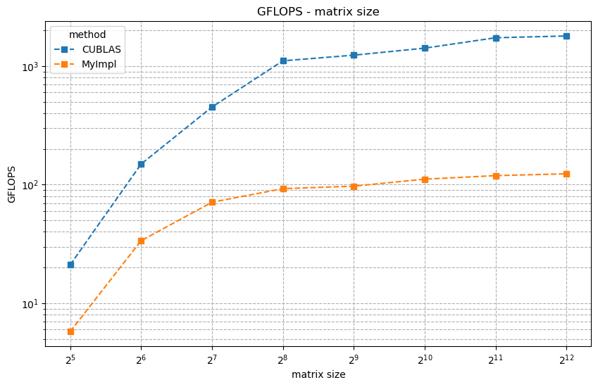

<div class="cover" style="page-break-after:always;font-family:方正公文仿宋;width:100%;height:100%;border:none;margin: 0 auto;text-align:center;">
    <div style="width:50%;margin: 0 auto;height:0;padding-bottom:10%;">
        </br>
        
    </div>
    </br></br>
    <div style="width:40%;margin: 0 auto;height:0;padding-bottom:40%;">
        
    </div>
		</br></br></br>
    <span style="font-family:华文黑体Bold;text-align:center;font-size:20pt;margin: 10pt auto;line-height:30pt;">本科生实验报告</span>
    </br>
    </br>
    <table style="border:none;text-align:center;width:72%;font-family:仿宋;font-size:14px; margin: 0 auto;">
    <tbody style="font-family:方正公文仿宋;font-size:12pt;">
        <tr style="font-weight:normal;"> 
            <td style="width:20%;text-align:center;">实验课程</td>
            <td style="width:40%;font-weight:normal;border-bottom: 1px solid;text-align:center;font-family:华文仿宋">并行程序设计与算法实验</td>
      </tr>
        <tr style="font-weight:normal;"> 
            <td style="width:20%;text-align:center;">实验名称</td>
            <td style="width:40%;font-weight:normal;border-bottom: 1px solid;text-align:center;font-family:华文仿宋">10-CUDA并行矩阵乘法</td>
      </tr>
        <tr style="font-weight:normal;"> 
            <td style="width:20%;text-align:center;">专业名称</td>
            <td style="width:40%;font-weight:normal;border-bottom: 1px solid;text-align:center;font-family:华文仿宋">计算机科学与技术</td>
      </tr>
        <tr style="font-weight:normal;"> 
            <td style="width:20%;text-align:center;">学生姓名</td>
            <td style="width:40%;font-weight:normal;border-bottom: 1px solid;text-align:center;font-family:华文仿宋">李世源</td>
      </tr>
        <tr style="font-weight:normal;"> 
            <td style="width:20%;text-align:center;">学生学号</td>
            <td style="width:40%;font-weight:normal;border-bottom: 1px solid;text-align:center;font-family:华文仿宋">22342043</td>
      </tr>
        <tr style="font-weight:normal;"> 
            <td style="width:20%;text-align:center;">实验地点</td>
            <td style="width:40%;font-weight:normal;border-bottom: 1px solid;text-align:center;font-family:华文仿宋"></td>
      </tr>
        <tr style="font-weight:normal;"> 
            <td style="width:20%;text-align:center;">实验成绩</td>
            <td style="width:40%;font-weight:normal;border-bottom: 1px solid;text-align:center;font-family:华文仿宋"></td>
      </tr>
      <tr style="font-weight:normal;"> 
            <td style="width:20%;text-align:center;">报告时间</td>
            <td style="width:40%;font-weight:normal;border-bottom: 1px solid;text-align:center;font-family:华文仿宋">2025年06月27日</td>
      </tr>
    </tbody>              
    </table>
</div>


<!-- 注释语句：导出PDF时会在这里分页，使用 Typora Newsprint 主题放大 125% -->


# 实验环境

我的测试平台环境信息如下：

|              CPU            |            GPU          | CUDA |     OS     |
|-----------------------------|-------------------------|------|------------|
| AMD Ryzen 9 7950X3D 16-Core | NVIDIA GeForce GTX 1050 | 12.9 | Arch Linux |

# 代码介绍

`Makefile` 中定义了开发、构建、测试，使用如下：

```shell
# 生成 LSP 配置文件
make dev

# 构建带符号表的程序用于 debug
make debug

# 构建程序
make release

# 单独运行程序测试
./build-release/test

# 运行全部测试
make test

# 清空已构建内容
make clean
```

使用 jupyter notebook 脚本 `draw.ipynb` 根据 `make test` 输出的结果画图，直观展示测试结果随相关参数的变化情况。实验报告中的曲线图由该脚本生成。

# 实验要求

**输入**：三个整数 `n,m,k`，其取值范围为 `[128,2048]`

**问题描述**：随机生成 $m\times n$ 的矩阵 A 及 $n\times k$ 的矩阵 B，并对这两个矩阵进行矩阵乘法运算，得到矩阵 C。

**输出**：A, B, C 三个矩阵，及矩阵计算所消耗的时间 t

**要求**：使用 CUDA 实现并行矩阵乘法，分析不同线程块大小，矩阵规模，访存方式，任务/数据划分方式，对程序性能的影响。

# 程序实现

## 实现原理

核心优化思想是如下：

1. **Tiling优化**：将大矩阵分割为小块（tile），每个线程块处理一个小块，利用共享内存减少全局内存访问
2. **共享内存使用**：每个线程块将所需的矩阵块加载到共享内存中，供块内所有线程共享访问
3. **并行计算**：利用 GPU 的线程层次结构（grid-block-thread）实现大规模并行计算
4. **内存访问优化**：通过合理的线程索引计算实现合并内存访问

## 核心代码解析

### 1. CPU参考实现 (`matrixMulCPU`)

这个函数我使用 OpenMP 加速，在 CPU 上运行作为参考，程序运行时若设置 `verify` 参数则用于验证并行计算结果。

```c
void matrixMulCPU(float *C, const float *A, const float *B, unsigned int hA,
                  unsigned int wA, unsigned int wB) {
  omp_set_num_threads(16);
  #pragma omp parallel for collapse(2) schedule(dynamic)
  for (unsigned int i = 0; i < hA; ++i)
    for (unsigned int j = 0; j < wB; ++j) {
      double sum = 0;
      for (unsigned int k = 0; k < wA; ++k) {
        double a = A[i * wA + k];
        double b = B[k * wB + j];
        sum += a * b;
      }
      C[i * wB + j] = (float)sum;
    }
}
```

### 2. CUDA核函数 (`gemmKernel`)

```c
__global__ void gemmKernel(
  float* __restrict__ A,
  float* __restrict__ B,
  float* __restrict__ C,
  sMatrixSize matrix_size
) {
  __shared__ float shareA[BLOCK_SIZE][BLOCK_SIZE];
  __shared__ float shareB[BLOCK_SIZE][BLOCK_SIZE];
  int bx = blockIdx.x;
  int by = blockIdx.y;
  int tx = threadIdx.x;
  int ty = threadIdx.y;
  int row = by * BLOCK_SIZE + ty;
  int col = bx * BLOCK_SIZE + tx;
  float temp = 0;
  for(int i = 0; i < matrix_size.uiWA/BLOCK_SIZE; ++i){
    shareA[ty][tx] = A[row*matrix_size.uiWA + (i*BLOCK_SIZE + tx)];
    shareB[ty][tx] = B[(i*BLOCK_SIZE + ty)*matrix_size.uiWB + col];
    __syncthreads();
    for(int k = 0; k < BLOCK_SIZE; ++k){
      temp += shareA[ty][k] * shareB[k][tx];
      __syncthreads();
    }
  }
  C[row*matrix_size.uiWC + col] = temp;
}
```

为了实现更简单，省去繁琐的边界判断逻辑，这里假设矩阵尺寸是一个宏定义参数 BLOCK_SIZE 的倍数。使用 `__shared__` 声明共享内存，存储矩阵块，每个线程计算输出矩阵 C 的一个元素，外层循环遍历所有需要的矩阵块，内层循环计算当前块的乘积累加，通过 `__syncthreads()` 确保块内所有线程同步，另外还通过 `__restrict__` 关键字帮助编译器优化内存访问。

### 3. 核函数调用封装 (`gemm`)

```c
void gemm(float* A, float* B, float* C, sMatrixSize &matrix_size) {
  dim3 blockDim(BLOCK_SIZE, BLOCK_SIZE);
  dim3 gridDim(
    matrix_size.uiWB / blockDim.x,
    matrix_size.uiHA / blockDim.y
  );

  gemmKernel<<<gridDim, blockDim>>>(A, B, C, matrix_size);
  checkCudaErrors(cudaDeviceSynchronize());
}
```

这个函数设置线程块和网格维度，调用核函数并同步。

### 4. 性能测试框架 (`matrixMultiply`)

```c
void matrixMultiply(int argc, char **argv, int devID, sMatrixSize &matrix_size, int method, int verify) {
  // ... 内存分配和初始化
  
  // 执行多次迭代计算平均性能
  for (int j = 0; j < nIter; j++) {
    if (method) {
      gemm(d_A, d_B, d_C, matrix_size); // 我的实现
    } else {
      // CUBLAS实现
      cublasSgemm(handle, CUBLAS_OP_N, CUBLAS_OP_N, 
                 matrix_size.uiWB, matrix_size.uiHA, matrix_size.uiWA, 
                 &alpha, d_B, matrix_size.uiWB, d_A, matrix_size.uiWA, 
                 &beta, d_C, matrix_size.uiWB);
    }
  }
  
  // ... 性能计算和验证
}
```

代码支持两种实现方法的性能比较，使用 CUDA 事件精确计时，并计算 GFLOPS。

另外，还可选验证计算结果正确性：

```cpp
if (verify) {
	// compute reference solution
	printf("Computing result using host CPU...");
	float *reference = (float *)malloc(mem_size_C);
	matrixMulCPU(reference, h_A, h_B, matrix_size.uiHA, matrix_size.uiWA,
							matrix_size.uiWB);
	printf("done.\n");

	// check result (CUBLAS)
	bool resCUBLAS = sdkCompareL2fe(reference, h_CUBLAS, size_C, 1.0e-6f);

	if (resCUBLAS != true) {
		printDiff(reference, h_CUBLAS, matrix_size.uiWC, matrix_size.uiHC, 100,
							1.0e-5f);
	}

	printf("Comparing CUBLAS Matrix Multiply with CPU results: %s\n",
				(true == resCUBLAS) ? "PASS" : "FAIL");
	
	free(reference);
}
```

# 性能测试

## 结果展示

我的实现和 CUBLAS 实现在输入矩阵规模从 `32*32` 到 `4096*4096` 下 GFLOPS 的变化情况如下所示：

| 矩阵规模(N×N) | CUBLAS GFLOPS | CUBLAS msec  | MyImpl GFLOPS | MyImpl msec  |
|---------------|---------------|--------------|---------------|--------------|
| 32×32         | 21.100        | 0.003        | 5.770         | 0.011        |
| 64×64         | 149.130       | 0.004        | 33.670        | 0.016        |
| 128×128       | 451.760       | 0.009        | 71.040        | 0.059        |
| 256×256       | 1108.280      | 0.030        | 92.520        | 0.363        |
| 512×512       | 1236.920      | 0.217        | 97.080        | 2.765        |
| 1024×1024     | 1417.030      | 1.515        | 111.300       | 19.295       |
| 2048×2048     | 1734.490      | 9.905        | 119.140       | 144.204      |
| 4096×4096     | 1795.430      | 76.549       | 123.460       | 1113.218     |




## 性能分析

### 1. 对比分析

从GFLOPS指标来看：
- CUBLAS实现从32×32矩阵的21.1 GFLOPS快速增长到4096×4096矩阵的1795.43 GFLOPS，性能提升了约85倍
- 我的实现从5.77 GFLOPS增长到123.46 GFLOPS，性能提升了约21倍
- 在最小规模(32×32)时，CUBLAS性能是我的实现的3.66倍
- 在最大规模(4096×4096)时，性能差距扩大到14.54倍

从执行时间来看：
- 对于小规模矩阵(32×32到128×128)，两种实现的执行时间差异不大(微秒级)
- 从 256×256 开始，我的实现的执行时间增长明显快于 CUBLAS
- 在 4096×4096 规模时，CUBLAS 仅需 76.549 ms，而我的实现需要 1113.218ms，相差近 14.5 倍

这种差距随矩阵规模增大而扩大的现象验证了 CUBLAS 库针对大规模矩阵计算进行了高度优化，可能使用了更高效的内存访问模式(如共享内存、寄存器优化等)。我的实现可能没有充分利用GPU的并行计算能力，或者存在内存访问瓶颈。

### 2. 性能变化趋势分析

观察性能随矩阵规模的变化：
- CUBLAS性能在1024×1024规模后增长放缓，在2048×2048后趋于稳定(约1700-1800 GFLOPS)
- 我的实现性能在512×512后增长极其缓慢，基本维持在100-120 GFLOPS区间
- 两种实现在小规模时性能差距较小，随着规模增大差距显著扩大

同时，两种实现都随着矩阵规模增大，GFLOPS 提升受到限制，都逐渐达到性能上限。

## 优化方向

对我的实现，可能的优化方向有：
1. 实现分块矩阵乘法以减少全局内存访问
2. 优化线程块和网格的配置以提高GPU利用率
3. 优化对共享内存的使用来复用数据，减少全局内存访问延迟
4. 考虑使用 CUDA 的 Tensor Core 等硬件加速特性
