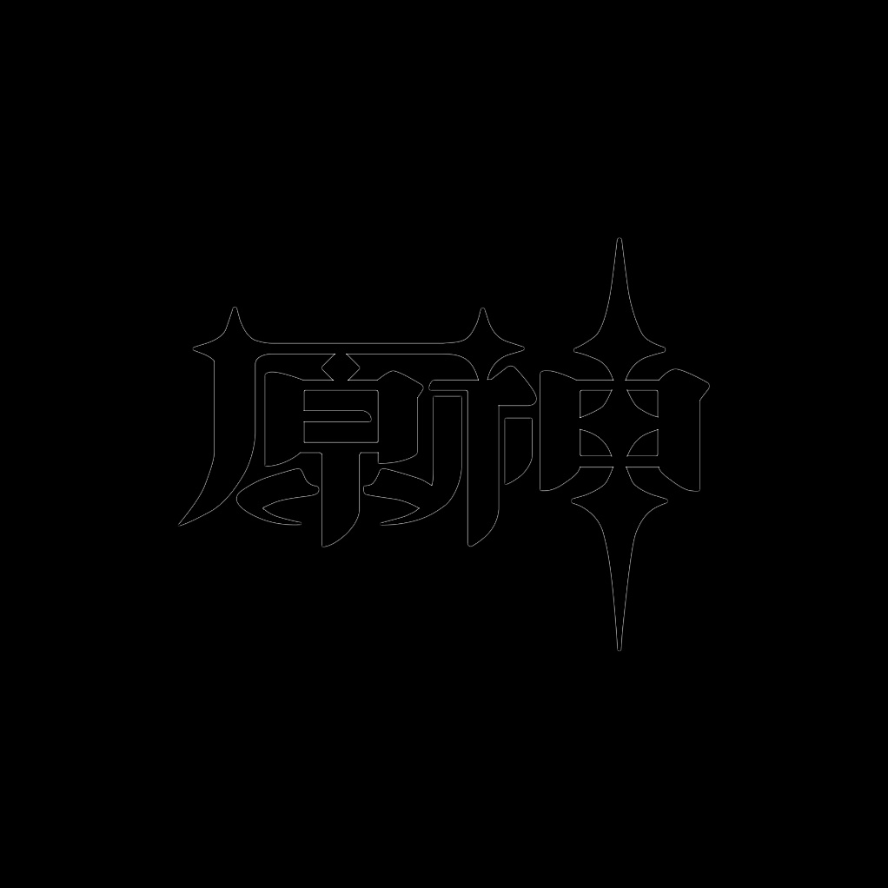
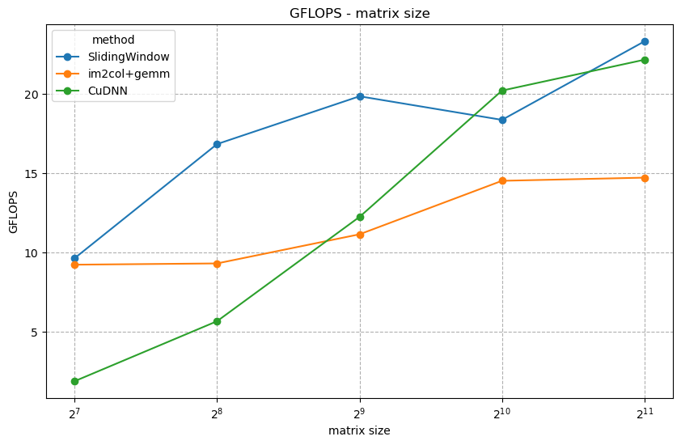
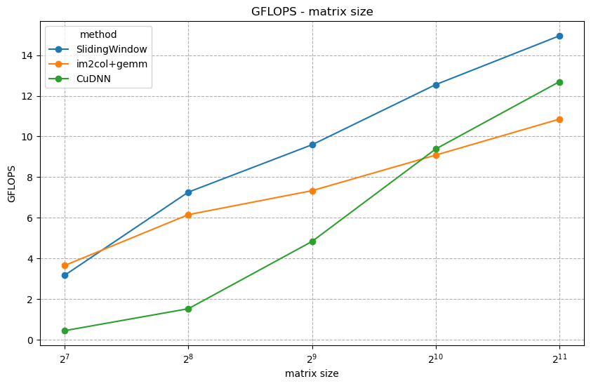
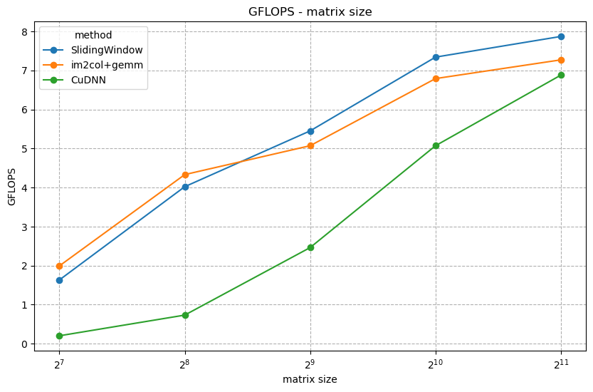

<div class="cover" style="page-break-after:always;font-family:方正公文仿宋;width:100%;height:100%;border:none;margin: 0 auto;text-align:center;">
    <div style="width:50%;margin: 0 auto;height:0;padding-bottom:10%;">
        </br>
        
    </div>
    </br></br>
    <div style="width:40%;margin: 0 auto;height:0;padding-bottom:40%;">
        
    </div>
		</br></br></br>
    <span style="font-family:华文黑体Bold;text-align:center;font-size:20pt;margin: 10pt auto;line-height:30pt;">本科生实验报告</span>
    </br>
    </br>
    <table style="border:none;text-align:center;width:72%;font-family:仿宋;font-size:14px; margin: 0 auto;">
    <tbody style="font-family:方正公文仿宋;font-size:12pt;">
        <tr style="font-weight:normal;"> 
            <td style="width:20%;text-align:center;">实验课程</td>
            <td style="width:40%;font-weight:normal;border-bottom: 1px solid;text-align:center;font-family:华文仿宋">并行程序设计与算法实验</td>
      </tr>
        <tr style="font-weight:normal;"> 
            <td style="width:20%;text-align:center;">实验名称</td>
            <td style="width:40%;font-weight:normal;border-bottom: 1px solid;text-align:center;font-family:华文仿宋">11-CUDA卷积计算</td>
      </tr>
        <tr style="font-weight:normal;"> 
            <td style="width:20%;text-align:center;">专业名称</td>
            <td style="width:40%;font-weight:normal;border-bottom: 1px solid;text-align:center;font-family:华文仿宋">计算机科学与技术</td>
      </tr>
        <tr style="font-weight:normal;"> 
            <td style="width:20%;text-align:center;">学生姓名</td>
            <td style="width:40%;font-weight:normal;border-bottom: 1px solid;text-align:center;font-family:华文仿宋">李世源</td>
      </tr>
        <tr style="font-weight:normal;"> 
            <td style="width:20%;text-align:center;">学生学号</td>
            <td style="width:40%;font-weight:normal;border-bottom: 1px solid;text-align:center;font-family:华文仿宋">22342043</td>
      </tr>
        <tr style="font-weight:normal;"> 
            <td style="width:20%;text-align:center;">实验地点</td>
            <td style="width:40%;font-weight:normal;border-bottom: 1px solid;text-align:center;font-family:华文仿宋"></td>
      </tr>
        <tr style="font-weight:normal;"> 
            <td style="width:20%;text-align:center;">实验成绩</td>
            <td style="width:40%;font-weight:normal;border-bottom: 1px solid;text-align:center;font-family:华文仿宋"></td>
      </tr>
      <tr style="font-weight:normal;"> 
            <td style="width:20%;text-align:center;">报告时间</td>
            <td style="width:40%;font-weight:normal;border-bottom: 1px solid;text-align:center;font-family:华文仿宋">2025年06月27日</td>
      </tr>
    </tbody>              
    </table>
</div>


<!-- 注释语句：导出PDF时会在这里分页，使用 Typora Newsprint 主题放大 125% -->

# 实验介绍

在信号处理、图像处理和其他工程/科学领域，卷积是一种使用广泛的技术。在深度学习领域，卷积神经网络 (CNN) 这种模型架构就得名于这种技术。在本实验中，我们将在 GPU 上实现卷积操作，注意这里的卷积是指神经网络中的卷积操作，与信号处理领域中的卷积操作不同，它不需要对 Filter 进行翻转，不考虑 bias

# 实验要求

分为 3 个任务：
- 任务一通过 CUDA 实现直接卷积（滑窗法）；
- 任务二使用 im2col 方法结合上次实验实现的 GEMM 实现卷积操作；
- 任务三使用 cuDNN 提供的卷积方法进行卷积操作。

**输入**：Input matrix size 和 Kernel size, 例如 32 和 3。

**问题描述**：用直接卷积的方式对 Input 进行卷积，这里只需要实现 2D, `height*width`，通道 channel(depth) 设置为 `3`，Kernel (Filter) 大小设置为 `3*3`，kernel channel(depth) 设置为 `3`，步幅 (stride) 分别设置为 `1`，`2`，`3`，可能需要通过填充 (padding) 配合步幅 (stride) 完成 CNN 操作。

输入从 `256*256` 增加至 `4096*4096` 或者输入从 `32*32` 增加至 `512*512`。

记录相应 Input 的卷积时间，将 cuDNN 与自己实现的卷积操作进行比较。如果性能不如 cuDNN，用文字描述可能的改进方法。

> 注：实验的卷积操作不需要考虑 bias(b)，bias 设置为 `0`。

# 实验环境

我的测试平台环境信息如下：

|              CPU            |            GPU          | CUDA |     OS     | OpenCV |
|-----------------------------|-------------------------|------|------------|--------|
| AMD Ryzen 9 7950X3D 16-Core | NVIDIA GeForce GTX 1050 | 12.9 | Arch Linux | 4.11.0 |

# 代码介绍

`Makefile` 中定义了开发、构建、测试，使用如下：

```shell
# 生成 LSP 配置文件
make dev

# 构建带符号表的程序用于 debug
make debug

# 构建程序
make release

# 单独运行程序测试
./build-release/test
  --input=images/input_2048.png \  # 输入图片路径
  --output=images/output.jpf \     # 输出文件路径
  --method=2 \  # 0表示滑动窗口,1表示im2col+gemm,其他表示cuDNN
  --stride=1

# 运行全部测试
make test  # stride=1
make test-stride2
make test-stride3

# 清空已构建内容
make clean
```

使用 jupyter notebook 脚本 `draw.ipynb` 根据 `make test` 输出的结果画图，直观展示测试结果随相关参数的变化情况。实验报告中的曲线图由该脚本生成。

另外，为了直观展示卷积的效果，我使用 OpenCV 辅助读取图像并保存卷积结果。输入图像为至少包含 RGB 3 通道的图片，在我的实验中我基于一个 `4096*4096` 大小的图片 (`images/input_4096.png`) 依次生成了到 `128*128` 为止的不同分辨率图片，使用 ffmpeg 生成它们的指令如下:

```shell
ffmpeg -i input_4096.png -vf "scale=128:128" input_128.png
ffmpeg -i input_4096.png -vf "scale=256:256" input_256.png
ffmpeg -i input_4096.png -vf "scale=512:512" input_512.png
ffmpeg -i input_4096.png -vf "scale=1024:1024" input_1024.png
```

在我的代码中硬编码了预设好的 3 输出通道、3 输出通道、大小 `3*3` 的卷积核，每一个 `3*3` 卷积核都是一个基础的边缘检测卷积核，这些信息定义如下：

```c
#define BATCH_SIZE 1
#define KERNEL_H 3
#define KERNEL_W 3
#define CHANNELS 3 // 认为是 RGB 三通道
const float KERNEL[KERNEL_H * KERNEL_W * CHANNELS * CHANNELS] = {
  1,  1, 1,
  1, -8, 1,
  1,  1, 1,
  // ... 总共 9 个重复的如上卷积核 ...
};
```

# 卷积实现

## 1.滑动窗口

代码实现位于 `src/conv_sliding_window.cu`

### 实现原理

滑动窗口的实现原理比较简单，主要是并行计算每个输出像素的值，每个线程负责计算输出特征图的一个像素点。我的代码输入数据采用 HWC 格式（高度-宽度-通道），因为这是 OpenCV 常用的内存布局方式，方便处理图像。同时通过 padding 参数控制边界处理方式，当窗口超出输入边界时自动忽略越界部分，相当于隐式零填充。

我的代码总体实现思路如下：

1. **内存访问模式**：输入数据采用HWC布局，而卷积核采用[height][width][channel]的布局，这种布局有利于内存的连续访问。

2. **边界处理**：在核函数中通过条件判断 `if (in_y >= 0 && in_y < input_h && in_x >= 0 && in_x < input_w)` 实现了隐式的零填充。

3. **并行策略**：每个CUDA线程负责计算输出特征图的一个像素点，通过block和grid的划分实现大规模并行。

4. **多通道处理**：外层循环遍历所有输入通道，内层循环计算卷积核与输入窗口的点积。

5. **输出处理**：每个输出通道的结果单独存储，最后使用 OpenCV 的 merge 函数合并成多通道图像。


### 核心代码解析

#### 1.CUDA核函数 `conv2d_kernel`

```cpp
__global__ void conv2d_kernel(
  const float* input, const float* kernel, float* output,
  int input_h, int input_w,
  int kernel_h, int kernel_w,
  int channels, int stride, int padding,
  int output_h, int output_w
) {
  // 计算当前线程负责的输出像素坐标
  int out_x = blockIdx.x * blockDim.x + threadIdx.x;
  int out_y = blockIdx.y * blockDim.y + threadIdx.y;
  
  if (out_x < output_w && out_y < output_h) {
    float acc = 0.0f;
    // 计算输入图像上的起始位置（考虑stride和padding）
    int in_base_y = out_y * stride - padding;
    int in_base_x = out_x * stride - padding;
    
    // 遍历所有输入通道
    for (int c = 0; c < channels; ++c) {
      // 遍历卷积核的每个元素
      for (int kh = 0; kh < kernel_h; ++kh) {
        for (int kw = 0; kw < kernel_w; ++kw) {
          // 计算输入图像中的实际位置
          int in_y = in_base_y + kh;
          int in_x = in_base_x + kw;
          
          // 边界检查
          if (in_y >= 0 && in_y < input_h && in_x >= 0 && in_x < input_w) {
            // 计算输入和卷积核的索引
            int input_idx = (in_y * input_w + in_x) * channels + c;
            int kernel_idx = (kh * kernel_w + kw) * channels + c;
            // 累加乘积
            acc += input[input_idx] * kernel[kernel_idx];
          }
        }
      }
    }
    // 将结果写入输出
    output[out_y * output_w + out_x] = acc;
  }
}
```

#### 2.主机函数 `conv_sliding_window`

```cpp
cv::Mat conv_sliding_window(
  cv::Mat &image,
  float * kernel,
  int kernel_h,
  int kernel_w,
  int in_channels,
  int stride,
  int padding,
  int batch_size
) {
  // 参数检查和输出尺寸计算
  // ...
  
  // 分配GPU内存
  float *d_input, *d_kernel, *d_output;
  cudaMalloc(&d_input, input_bytes);
  cudaMalloc(&d_kernel, kernel_bytes);
  cudaMalloc(&d_output, output_bytes);
  
  // 拷贝输入数据到GPU
  cudaMemcpy(d_input, image.ptr<float>(0), input_bytes, cudaMemcpyHostToDevice);
  
  // 设置CUDA核函数的执行配置
  dim3 threadsPerBlock(16, 16);
  dim3 numBlocks(
    (out_width + threadsPerBlock.x - 1) / threadsPerBlock.x, 
    (out_height + threadsPerBlock.y - 1) / threadsPerBlock.y
  );
  
  // 处理每个输出通道
  std::vector<cv::Mat> mv;
  for (int i = 0; i < out_channels; ++i) {
    // 拷贝当前通道的卷积核到GPU
    cudaMemcpy(d_kernel, kernel + (kernel_bytes/sizeof(float)), kernel_bytes, cudaMemcpyHostToDevice);
    
    // 执行卷积核函数
    conv2d_kernel<<<numBlocks, threadsPerBlock>>>(
      d_input, d_kernel, d_output,
      in_height, in_width,
      kernel_h, kernel_w,
      in_channels, stride, padding,
      out_height, out_width
    );
    
    // 将结果拷贝回主机
    mv.emplace_back(cv::Mat(out_height, out_width, CV_32FC1));
    cudaDeviceSynchronize();
    cudaMemcpy(mv[i].ptr(0), d_output, output_bytes, cudaMemcpyDeviceToHost);
  }
  
  // 合并通道并清理资源
  cv::Mat output_image(out_height, out_width, CV_32FC3);
  cv::merge(mv, output_image);
  
  cudaFree(d_kernel);
  cudaFree(d_input);
  cudaFree(d_output);
  return output_image;
}
```


## 2.im2col+gemm

代码实现位于 `src/conv_im2col_gemm.cu`

### 实现原理

im2col + GEMM 是一种高效的卷积计算方法，它将卷积操作转换为矩阵乘法，从而可以利用非常适合 GPU 的矩阵乘法来加速计算。其核心思想分为两个步骤：

1. **im2col（Image to Column）**：将输入图像数据重新排列成适合矩阵乘法的形式。对于每个卷积窗口位置，将其展开为一列，形成一个大的矩阵。

2. **GEMM（General Matrix Multiplication）**：将卷积核也展开成矩阵形式，然后与 im2col 转换后的矩阵进行矩阵乘法运算。

这种方法的主要优势在于：
- 将卷积操作转换为标准的矩阵乘法
- 可以利用 GPU 上高度优化的矩阵乘法实现
- 减少了内存访问的不规则性，提高了内存访问效率

### 核心代码解析

#### 1. im2col_kernel

```cpp
__global__ void im2col_kernel(
  const float* input_data, float* col_data,
  int channels,
  int in_h, int in_w,
  int ker_h, int ker_w,
  int stride_h, int stride_w,
  int pad_h, int pad_w,
  int out_h, int out_w
) {
  // 计算当前线程处理的输出位置
  int out_y = blockIdx.y * blockDim.y + threadIdx.y;
  int out_x = blockIdx.x * blockDim.x + threadIdx.x;

  if (out_y < out_h && out_x < out_w) {
    int col_index = out_y * out_w + out_x;
    // 遍历所有输入通道
    for (int c = 0; c < channels; ++c) {
      // 遍历卷积核的每个元素
      for (int kh = 0; kh < ker_h; ++kh) {
        for (int kw = 0; kw < ker_w; ++kw) {
          // 计算输入图像中的对应位置
          int in_y = out_y * stride_h - pad_h + kh;
          int in_x = out_x * stride_w - pad_w + kw;

          // 计算在展开矩阵中的位置
          int row_index = c * ker_h * ker_w + kh * ker_w + kw;
          int col_buffer_index = row_index * (out_h * out_w) + col_index;

          // 处理边界情况（padding）
          if (in_y >= 0 && in_y < in_h && in_x >= 0 && in_x < in_w) {
            col_data[col_buffer_index] = input_data[c * in_h * in_w + in_y * in_w + in_x];
          } else {
            col_data[col_buffer_index] = 0.0f;
          }
        }
      }
    }
  }
}
```

#### 2. gemm_kernel

```cpp
__global__ void gemm_kernel(
  const float* A,
  const float* B,
  float* C,
  int m, int n, int k
) {
  // 使用共享内存提高性能
  __shared__ float shareA[BLOCK_SIZE][BLOCK_SIZE];
  __shared__ float shareB[BLOCK_SIZE][BLOCK_SIZE];
  
  int bx = blockIdx.x;
  int by = blockIdx.y;
  int tx = threadIdx.x;
  int ty = threadIdx.y;
  int row = by * BLOCK_SIZE + ty;
  int col = bx * BLOCK_SIZE + tx;
  float temp = 0;
  
  // 分块矩阵乘法
  for (int t = 0; t < (n + BLOCK_SIZE - 1) / BLOCK_SIZE; t++) {
    // 加载数据到共享内存
    if (row < m && t * BLOCK_SIZE + tx < n) {
      shareA[ty][tx] = A[row * n + t * BLOCK_SIZE + tx];
    } else {
      shareA[ty][tx] = 0.0f;
    }
    if (t * BLOCK_SIZE + ty < n && col < k) {
      shareB[ty][tx] = B[(t * BLOCK_SIZE + ty) * k + col];
    } else {
      shareB[ty][tx] = 0.0f;
    }
    __syncthreads();
    
    // 计算部分结果
    if (row < m && col < k) {
      for (int i = 0; i < BLOCK_SIZE; i++) {
        temp += shareA[ty][i] * shareB[i][tx];
      }
    }
    __syncthreads();
  }
  
  // 写入最终结果
  if (row < m && col < k) {
    C[row * k + col] = temp;
  }
}
```

#### 3. 主函数 conv_im2col_gemm

```cpp
cv::Mat conv_im2col_gemm(
  cv::Mat &image,
  float * kernel,
  int kernel_h,
  int kernel_w,
  int in_channels,
  int stride,
  int padding,
  int batch_size
) {
  // 参数检查和输出尺寸计算
  // ...
  
  // 分配GPU内存
  float *d_input, *d_kernel, *d_output, *d_col;
  cudaMalloc(&d_input, input_bytes);
  cudaMalloc(&d_col, col_bytes);
  cudaMemcpy(d_input, image.ptr<float>(0), input_bytes, cudaMemcpyHostToDevice);
  
  // 执行im2col转换
  dim3 im2col_block(BLOCK_SIZE, BLOCK_SIZE);
  dim3 im2col_grid(...);
  im2col_kernel<<<im2col_grid, im2col_block>>>(...);
  
  // 执行矩阵乘法
  cudaMalloc(&d_kernel, kernel_bytes);
  cudaMalloc(&d_output, output_bytes);
  cudaMemcpy(d_kernel, kernel, kernel_bytes, cudaMemcpyHostToDevice);
  
  dim3 gemm_block(BLOCK_SIZE, BLOCK_SIZE);
  dim3 gemm_grid(...);
  gemm_kernel<<<gemm_grid, gemm_block>>>(...);
  
  // 将结果拷贝回主机并清理GPU内存
  cv::Mat output_image(...);
  cudaMemcpy(output_image.ptr(0), d_output, output_bytes, cudaMemcpyDeviceToHost);
  
  cudaFree(d_col);
  cudaFree(d_kernel);
  cudaFree(d_output);
  return output_image;
}
```

### 性能优化点

1. **共享内存使用**：在 GEMM 核函数中使用共享内存来减少全局内存访问，提高数据重用率。

2. **分块计算**：将大矩阵乘法分解为小块处理，提高缓存命中率。

3. **线程组织**：合理设置线程块和网格大小，充分利用 GPU 的并行计算能力。

4. **边界处理**：在 im2col 阶段处理 padding 边界条件，避免额外的内存操作。

这种实现方式特别适合在 GPU 上执行，因为矩阵乘法在 GPU 上可以得到高度优化，然而 im2col 转换增加了显存占用，在我的 2 GiB 显存在本次实验中不足以处理 `4096*4096` 规模的图像输入，因此脚本批量测试中没有测试到这个规模。

## 3.cuDNN

代码实现位于 `src/conv_cudnn.cu`

### 实现原理

cuDNN 是 NVIDIA 提供的深度神经网络加速库，它针对卷积操作进行了高度优化。利用 cuDNN 实现卷积的主要流程如下：

1. **描述符创建与设置**：创建并配置输入张量、卷积核、卷积操作和输出张量的描述符
2. **自动算法选择**：让 cuDNN 自动选择最优的卷积算法
3. **GPU内存分配**：为输入、输出、卷积核和工作空间分配GPU内存
4. **数据传输**：将输入数据和卷积核从主机内存拷贝到GPU内存
5. **执行卷积**：调用 cuDNN 的卷积前向传播函数
6. **结果回传**：将卷积结果从 GPU 内存拷贝回主机内存

### 核心代码解析

#### 1. 初始化与描述符创建

```cpp
cudnnHandle_t cudnn;
checkCUDNN(cudnnCreate(&cudnn));  // 创建cuDNN上下文句柄
```

首先创建cuDNN的上下文句柄，这是所有cuDNN操作的基础。

#### 2. 输入张量描述符

```cpp
cudnnTensorDescriptor_t input_descriptor;
checkCUDNN(cudnnCreateTensorDescriptor(&input_descriptor));
checkCUDNN(cudnnSetTensor4dDescriptor(
  input_descriptor,
  /*format=*/CUDNN_TENSOR_NHWC,  // 内存布局格式
  /*dataType=*/CUDNN_DATA_FLOAT,  // 数据类型
  /*batch_size=*/batch_size,      // 批大小
  /*channels=*/in_channels,       // 输入通道数
  /*image_height=*/image.rows,    // 图像高度
  /*image_width=*/image.cols      // 图像宽度
));
```

设置输入张量的描述符，指定了数据布局(NHWC)、数据类型(float)、批大小、通道数和图像尺寸。

#### 3. 卷积核描述符

```cpp
cudnnFilterDescriptor_t kernel_descriptor;
checkCUDNN(cudnnCreateFilterDescriptor(&kernel_descriptor));
checkCUDNN(cudnnSetFilter4dDescriptor(kernel_descriptor,
  /*dataType=*/CUDNN_DATA_FLOAT,
  /*format=*/CUDNN_TENSOR_NCHW,  // 卷积核内存布局
  /*out_channels=*/in_channels,   // 输出通道数
  /*in_channels=*/in_channels,    // 输入通道数
  /*kernel_height=*/kernelH,      // 卷积核高度
  /*kernel_width=*/kernelW        // 卷积核宽度
));
```

设置卷积核的描述符，注意卷积核的布局格式是NCHW，与输入不同。

#### 4. 卷积操作描述符

```cpp
cudnnConvolutionDescriptor_t convolution_descriptor;
checkCUDNN(cudnnCreateConvolutionDescriptor(&convolution_descriptor));
checkCUDNN(cudnnSetConvolution2dDescriptor(convolution_descriptor,
  /*pad_height=*/padding,         // 垂直方向填充
  /*pad_width=*/padding,          // 水平方向填充
  /*vertical_stride=*/stride,     // 垂直方向步长
  /*horizontal_stride=*/stride,   // 水平方向步长
  /*dilation_height=*/1,          // 垂直方向膨胀率
  /*dilation_width=*/1,           // 水平方向膨胀率
  /*mode=*/CUDNN_CROSS_CORRELATION, // 卷积模式
  /*computeType=*/CUDNN_DATA_FLOAT  // 计算类型
));
```

设置卷积操作的参数，包括填充、步长、膨胀率和计算模式等。

#### 5. 输出尺寸计算

```cpp
int out_batch_size, out_channels, out_height, out_width;
checkCUDNN(cudnnGetConvolution2dForwardOutputDim(
  convolution_descriptor,
  input_descriptor,
  kernel_descriptor,
  &out_batch_size,
  &out_channels,
  &out_height,
  &out_width
));
```

根据输入和卷积参数计算输出张量的尺寸。

#### 6. 选择最优卷积算法

```cpp
cudnnConvolutionFwdAlgoPerf_t algo_perf;
int returnedAlgoCount = 0;
checkCUDNN(cudnnGetConvolutionForwardAlgorithm_v7(
  cudnn,
  input_descriptor,
  kernel_descriptor,
  convolution_descriptor,
  output_descriptor,
  1,  // 请求的算法数量
  &returnedAlgoCount,
  &algo_perf
));
cudnnConvolutionFwdAlgo_t convolution_algorithm = algo_perf.algo;
```

这里让 cuDNN 自动选择最优的卷积算法。

#### 7. 工作空间分配

```cpp
size_t workspace_bytes = 0;
checkCUDNN(cudnnGetConvolutionForwardWorkspaceSize(
  cudnn,
  input_descriptor,
  kernel_descriptor,
  convolution_descriptor,
  output_descriptor,
  convolution_algorithm,
  &workspace_bytes
));
```

查询所选算法需要的工作空间大小，某些算法可能需要额外的临时存储空间。

#### 8. GPU内存分配与数据传输

```cpp
float *d_input, *d_kernel, *d_output, *d_workspace;
cudaMalloc(&d_workspace, workspace_bytes);  // 分配工作空间
cudaMalloc(&d_input, input_bytes);          // 分配输入内存
cudaMalloc(&d_kernel, kernel_bytes);        // 分配卷积核内存
cudaMalloc(&d_output, output_bytes);        // 分配输出内存

cudaMemcpy(d_input, image.ptr<float>(0), input_bytes, cudaMemcpyHostToDevice);
cudaMemcpy(d_kernel, kernel, kernel_bytes, cudaMemcpyHostToDevice);
```

分配GPU内存并将输入数据和卷积核从主机内存拷贝到GPU内存。

#### 9. 执行卷积

```cpp
const float alpha = 1, beta = 0;
checkCUDNN(cudnnConvolutionForward(
  cudnn,
  &alpha,                   // 输入缩放因子
  input_descriptor,         // 输入描述符
  d_input,                  // 输入数据
  kernel_descriptor,        // 卷积核描述符
  d_kernel,                 // 卷积核数据
  convolution_descriptor,   // 卷积描述符
  convolution_algorithm,    // 选择的算法
  d_workspace,              // 工作空间
  workspace_bytes,          // 工作空间大小
  &beta,                    // 输出缩放因子
  output_descriptor,        // 输出描述符
  d_output                  // 输出数据
));
```

这是核心的卷积操作调用，cuDNN会根据之前选择的算法执行高效的卷积计算。

#### 10. 结果回传与资源释放

```cpp
cv::Mat output_image(out_height, out_width, CV_32FC3);
cudaMemcpy(output_image.ptr(0), d_output, output_bytes, cudaMemcpyDeviceToHost);

// 释放所有分配的资源
cudaFree(d_kernel);
cudaFree(d_input);
cudaFree(d_output);
cudaFree(d_workspace);
// ... 销毁所有描述符和cuDNN句柄
```

将结果从GPU内存拷贝回主机内存，并释放所有分配的资源。

### 性能优化点

1. **自动算法选择**：`cudnnGetConvolutionForwardAlgorithm_v7` 让cuDNN自动选择最优算法。这也是我查阅资料所推荐的做法，但是这样做很有可能因为尝试不同算法产生了新的开销，这在我后面的性能分析中详细提及。
2. **工作空间优化**：只为实际需要的算法分配工作空间。不过我实验过程观察到我的程序挑选的算法都不需要额外空间，也就是 `workspace_bytes = 0`。
3. **内存布局**：使用 NHWC 格式更适合 OpenCV 的数据处理。

# 性能分析

我用 Makefile 脚本对我的程序在下运行 3 种实现下 `128*128` 到 `2048*2048` 分辨率的三通道输入图像测试。

## 结果展示

对于 `1024*1024` 的下面左侧的输入图像，我的程序在 `stride=1` 时能够得到右侧的边缘检测结果，可以验证我的卷积实现正确性：

<div style="text-align: center;">
  
  
</div>

`stride=1` 时测试结果如下：

|      | SlidingWindow |  im2col+gemm  |     CuDNN     |
|------|---------------|---------------|---------------|
|  128 |  9.420 GFLOPS |  9.340 GFLOPS |  1.670 GFLOPS |
|  256 | 16.770 GFLOPS |  8.910 GFLOPS |  5.340 GFLOPS |
|  512 | 19.760 GFLOPS | 10.950 GFLOPS | 12.180 GFLOPS |
| 1024 | 18.900 GFLOPS | 14.930 GFLOPS | 20.340 GFLOPS |
| 2048 | 23.990 GFLOPS | 14.960 GFLOPS | 22.400 GFLOPS |



`stride=2` 时测试结果如下：

|      | SlidingWindow |  im2col+gemm  |     CuDNN     |
|------|---------------|---------------|---------------|
|  128 |  3.170 GFLOPS |  3.650 GFLOPS |  0.440 GFLOPS | 
|  256 |  7.260 GFLOPS |  6.150 GFLOPS |  1.520 GFLOPS | 
|  512 |  9.590 GFLOPS |  7.330 GFLOPS |  4.830 GFLOPS | 
| 1024 | 12.550 GFLOPS |  9.080 GFLOPS |  9.380 GFLOPS | 
| 2048 | 14.950 GFLOPS | 10.850 GFLOPS | 12.690 GFLOPS | 



`stride=3` 时测试结果如下：

|      | SlidingWindow |  im2col+gemm  |     CuDNN     |
|------|---------------|---------------|---------------|
|  128 |  1.460 GFLOPS |  1.740 GFLOPS |  0.200 GFLOPS |
|  256 |  3.970 GFLOPS |  3.790 GFLOPS |  0.730 GFLOPS |
|  512 |  5.080 GFLOPS |  4.640 GFLOPS |  2.330 GFLOPS |
| 1024 |  6.920 GFLOPS |  6.190 GFLOPS |  5.060 GFLOPS |
| 2048 |  7.910 GFLOPS |  7.300 GFLOPS |  7.000 GFLOPS |



## 总体趋势分析

1. **输入尺寸影响**：
  - 所有实现方式都随着输入尺寸增大而表现出更高的计算吞吐量(GFLOPS)
  - 在较小输入尺寸(128×128)时，性能差异较大；随着尺寸增大，性能差距逐渐缩小
  - 2048×2048 时，三种实现性能最为接近

2. **步长影响**：
  - `stride=1` 时整体性能最高，随着 `stride` 增大，所有实现的GFLOPS值下降
  - stride增大带来的性能下降幅度：CuDNN > SlidingWindow > im2col+gemm

### 各实现方式对比分析

**1. SlidingWindow实现**：
- 优势：
  - 在小尺寸输入(128-512)时，`stride=1` 情况下性能领先其他实现
  - 对 `stride` 变化表现出较好的适应性，`stride` 增大时性能下降相对平缓
- 劣势：
  - 在大尺寸输入(1024+)时被 CuDNN 超越
  - 绝对性能随输入尺寸增长幅度不如 CuDNN 明显

**2. im2col+gemm实现**：
- 优势：
  - 性能表现最为稳定，在不同stride下变化幅度最小
  - 在小尺寸输入时优于CuDNN
- 劣势：
  - 从未在任何测试条件下达到最高性能
  - 性能增长随输入尺寸增大较为平缓

**3. CuDNN实现**：
- 优势：
  - 在大尺寸输入(1024+)时表现出最佳性能
  - `stride=1` 时性能随输入尺寸增长最为显著
- 劣势：
  - 主要因为最优算法的尝试和选择产生了更多时间开销，所以产生了小尺寸输入时性能显著低于其他实现的现象
  - 受 `stride` 影响最大，`stride` 增大时性能下降明显

### 特殊情况分析

1. **128×128小尺寸输入**：
  - CuDNN表现异常差，可能因为小尺寸下启动开销占比过大
  - SlidingWindow在小尺寸下优势明显，可能因其避免了im2col转换开销

2. **stride=3大尺寸时**：
  - 三种实现性能几乎收敛，说明在极端条件下各方法效率趋于接近

## 结论

通过本次实验性能测试可以得出以下结论：

1. **小尺寸输入**：SlidingWindow 实现最为高效，特别是当 `stride=1` 时
2. **大尺寸输入**：CuDNN 实现展现出最佳性能，体现了官方库对大尺寸计算的优化优势
3. **步长影响**：im2col+gemm 对 stride 变化最为鲁棒，而 CuDNN 受影响最大


> 参考资料：
> - https://www.goldsborough.me/cuda/ml/cudnn/c++/2017/10/01/14-37-23-convolutions_with_cudnn/