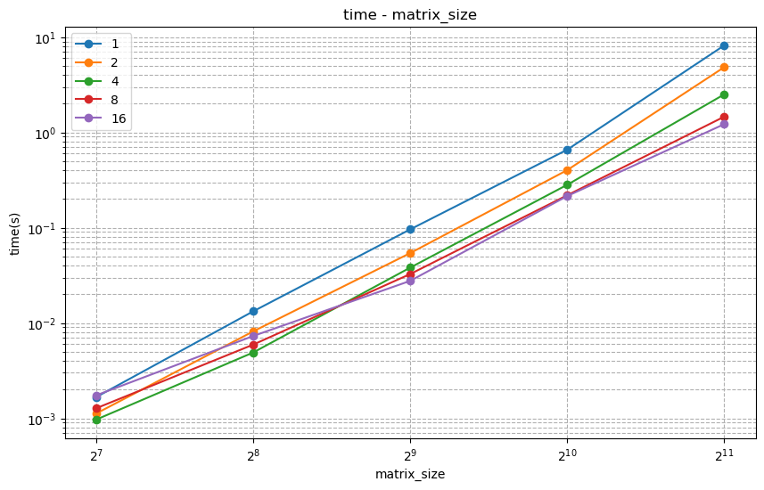
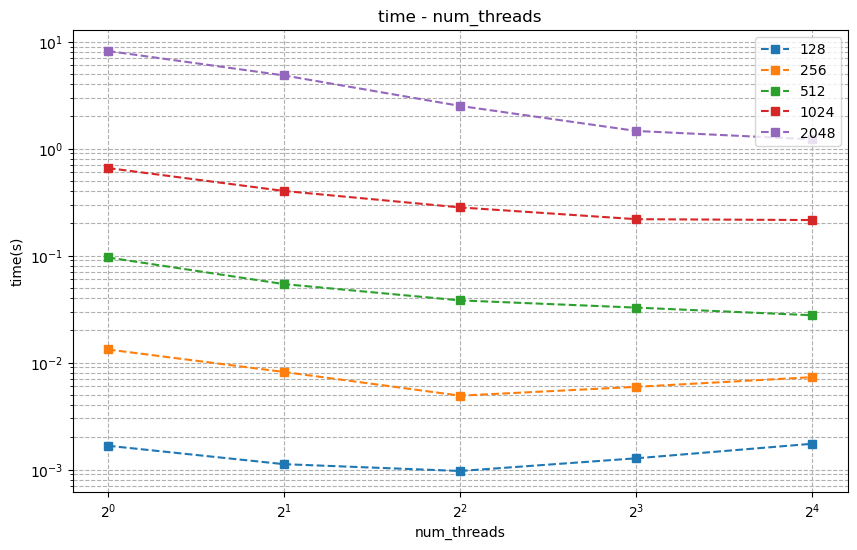
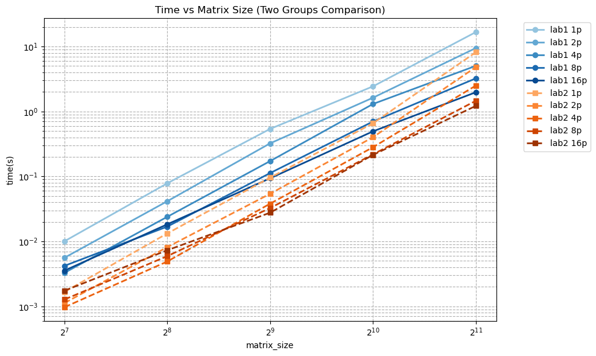
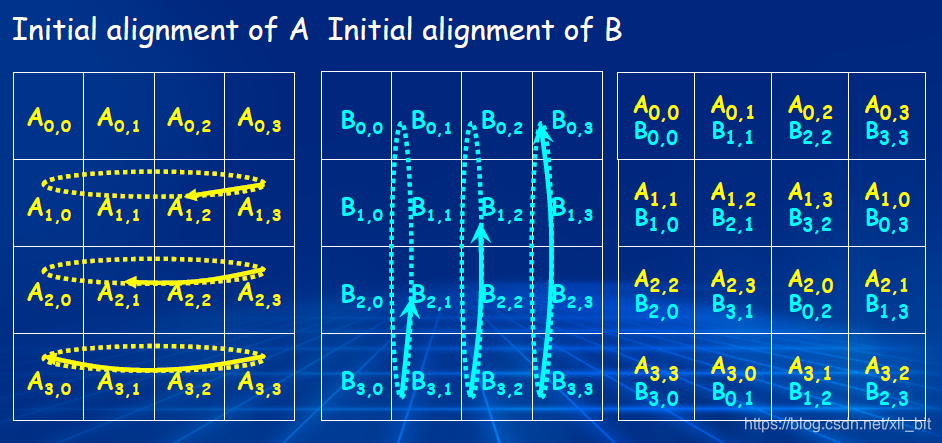
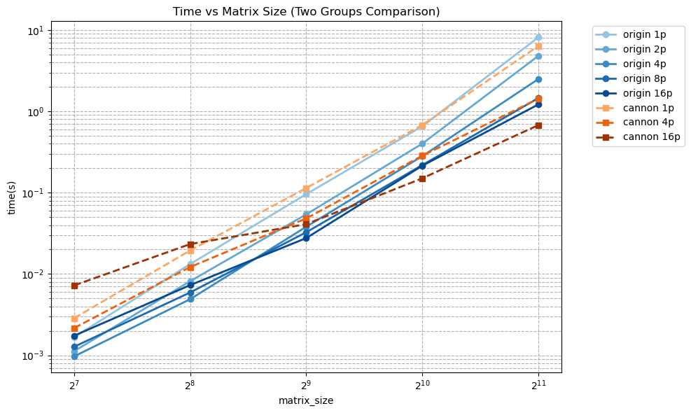

<div class="cover" style="page-break-after:always;font-family:方正公文仿宋;width:100%;height:100%;border:none;margin: 0 auto;text-align:center;">
    <div style="width:50%;margin: 0 auto;height:0;padding-bottom:10%;">
        </br>
        
    </div>
    </br></br>
    <div style="width:40%;margin: 0 auto;height:0;padding-bottom:40%;">
        
    </div>
    </br></br></br>
    <span style="font-family:华文黑体Bold;text-align:center;font-size:20pt;margin: 10pt auto;line-height:30pt;">本科生实验报告</span>
    </br>
    </br>
    <table style="border:none;text-align:center;width:72%;font-family:仿宋;font-size:14px; margin: 0 auto;">
    <tbody style="font-family:方正公文仿宋;font-size:12pt;">
        <tr style="font-weight:normal;"> 
            <td style="width:20%;text-align:center;">实验课程</td>
            <td style="width:40%;font-weight:normal;border-bottom: 1px solid;text-align:center;font-family:华文仿宋">并行程序设计与算法实验</td>
      </tr>
        <tr style="font-weight:normal;"> 
            <td style="width:20%;text-align:center;">实验名称</td>
            <td style="width:40%;font-weight:normal;border-bottom: 1px solid;text-align:center;font-family:华文仿宋">2-基于MPI的并行矩阵乘法（进阶）</td>
      </tr>
        <tr style="font-weight:normal;"> 
            <td style="width:20%;text-align:center;">专业名称</td>
            <td style="width:40%;font-weight:normal;border-bottom: 1px solid;text-align:center;font-family:华文仿宋">计算机科学与技术</td>
      </tr>
        <tr style="font-weight:normal;"> 
            <td style="width:20%;text-align:center;">学生姓名</td>
            <td style="width:40%;font-weight:normal;border-bottom: 1px solid;text-align:center;font-family:华文仿宋">李世源</td>
      </tr>
        <tr style="font-weight:normal;"> 
            <td style="width:20%;text-align:center;">学生学号</td>
            <td style="width:40%;font-weight:normal;border-bottom: 1px solid;text-align:center;font-family:华文仿宋">22342043</td>
      </tr>
        <tr style="font-weight:normal;"> 
            <td style="width:20%;text-align:center;">实验地点</td>
            <td style="width:40%;font-weight:normal;border-bottom: 1px solid;text-align:center;font-family:华文仿宋">北实验楼B202</td>
      </tr>
        <tr style="font-weight:normal;"> 
            <td style="width:20%;text-align:center;">实验成绩</td>
            <td style="width:40%;font-weight:normal;border-bottom: 1px solid;text-align:center;font-family:华文仿宋"></td>
      </tr>
      <tr style="font-weight:normal;"> 
            <td style="width:20%;text-align:center;">报告时间</td>
            <td style="width:40%;font-weight:normal;border-bottom: 1px solid;text-align:center;font-family:华文仿宋">2025年03月26日</td>
      </tr>
    </tbody>              
    </table>
</div>


<!-- 注释语句：导出PDF时会在这里分页，使用 Typora Newsprint 主题放大 125% -->


# 实验要求


改进上次实验中的MPI并行矩阵乘法(MPI-v1)，并讨论不同通信方式对性能的影响。


**输入**：$m,n,k$ 三个整数，每个整数的取值范围均为 $[128, 2048]$。


**问题描述：**随机生成 $m\times n$ 的矩阵 $A$ 及 $n\times k$ 的矩阵 $B$，并对这两个矩阵进行矩阵乘法运算，得到矩阵 $C$。


**输出**：$A,B,C$ 三个矩阵，及矩阵计算所消耗的时间 $t$。

**要求**：


1. 采用 MPI 集合通信实现并行矩阵乘法中的进程间通信；使用 `mpi_type_create_struct` 聚合 MPI 进程内变量后通信（例如矩阵尺寸`m`、`n`、`k` 或者其他变量）；
2. 对于不同实现方式，调整并记录不同线程数量（1-16）及矩阵规模（128-2048）下的时间开销，填写表格，并分析其性能及扩展性。
3. （选做）尝试不同数据/任务划分方式、稀疏矩阵、瘦长矩阵等特殊情况。

# 实验环境

我的测试平台处理器是 Intel Xeon E7 处理器，单槽 16 核，Intel 给出的性能信息如下：

| Processor Group                                              | GFLOPS | APP     |
| ------------------------------------------------------------ | ------ | ------- |
| Intel® Xeon® Processor E7-4830 v3 (30M Cache, 2.10 GHz) E7-4830V3 | 403.2  | 0.12096 |


# 代码介绍

`Makefile` 中定义了开发、构建、测试，使用如下：


```shell
# 生成 LSP 配置文件
make dev

# 只构建不测试
make build

# 运行单次测试，使用的单线程矩阵乘法为调整循环顺序且循环展开的版本
make test1 NP=16

# 运行单次测试，使用的单线程矩阵乘法为 Intel MKL 版本
make test2 NP=16

# 运行表格上的全部测试，输出表格形式的结果
make test1-all
make test2-all

# 测试 Cannon 算法
make cannon-all

# 清空已构建内容(build 目录)
make clean
```


测试时 `make` 指令需要设置 `NP` 变量来指定进程数量。在我的代码中，主进程会需要输入 3 个矩阵的规模参数：


- `M`，范围 $[128,2048]$，必须整除 `NP`。
- `N`，范围 $[128,2048]$。
- `K`，范围 $[128,2048]$。


我的代码逻辑中，矩阵分块是依据 A 矩阵的 M 行进行 NP 等分实现。考虑这样的逻辑下 `NP` 需要整除 `M`，所以上面我对 `M` 进行了整除 `NP` 的检查。

使用 jupyter notebook 脚本 `draw.ipynb` 根据 `make test` 或 `make cannon` 输出的结果 (`build/result.md`) 画图，直观展示性能变化情况。实验报告中的曲线图均由该脚本生成。

# 测试分析

我将先前实验分多次 `MPI_Send` 和 `MPI_Recv` 实现的局长参数同步，按照实验要求封装在一个结构体 `MatrixParams` 中，通过一次 `MPI_Bcast` 同步。

测试得到时间开销表格如下：

|    |     128     |     256     |     512     |     1024    |     2048    |
|----|-------------|-------------|-------------|-------------|-------------|
|  1 | 1.66835e-03 | 1.32502e-02 | 9.59873e-02 | 6.58199e-01 | 8.17653e+00 |
|  2 | 1.12193e-03 | 8.16287e-03 | 5.41153e-02 | 4.01933e-01 | 4.83201e+00 |
|  4 | 9.68929e-04 | 4.90063e-03 | 3.81060e-02 | 2.81869e-01 | 2.50542e+00 |
|  8 | 1.27327e-03 | 5.92803e-03 | 3.26247e-02 | 2.18852e-01 | 1.46194e+00 |
| 16 | 1.74109e-03 | 7.30088e-03 | 2.76674e-02 | 2.14820e-01 | 1.22021e+00 |

如下是固定时间开销随矩阵规模增加变化情况图，每条曲线代表一个固定进程数量：



可以看到随着矩阵规模增大，原本开销可能更大的多进程并行速度显著提升，并大幅超过较少进程的并行性能。

如下是时间开销随并行进程数量增加变化情况图，每条曲线代表一个固定矩阵规模：



可以看到，对于较大的矩阵规模（大于 512），随着进程数量增加，时间开销减少。但是对于较小的矩阵规模（128 和 256），随着进程数量增加，时间开销出现“先减少后增加”的趋势，可能是因为进程数量不太多时，并行有效地提升了性能，但进程数量超过 4 之后，却又因为进程间通信开销增大，反而增大了总体时间开销。

最后，我还和上一个实验的串行实现进行了性能对比。一开始我测试后和上一个实验的结果进行比较，发现几乎没有什么性能差别。但是我注意到我的编译参数一直使用 `-Ofast`，我猜测可能是编译器优化，上一个实验的点对点通信可能被编译器优化成集合通信。为了体现更加显著的差别，我修改编译参数为 `-O0` 完全禁用编译优化。在这个条件下，得到 lab1 和 lab2 对比时间开销随矩阵规模增加变化情况如下所示：(Group1 为 lab1 的实现，Group2 为 lab2 的按行划分实现)



可以看到每一个计算规模都有一定的提升，但并不是特别大幅度的提升，因为通信开销占比还是比较小，并且我所使用的集合 `MPI_Scatter`、`MPI_Bcast`、`MPI_Gather` 原理实际上就是逐个进行点对点通信，只是代码写出来更加简洁。


# 选作部分

除了上述最为简单的行划分数据划分方式，我考虑并实现了 2D 的块分解 Cannon 算法。块分解又称棋盘分解，将矩阵划分为大小相等的二维块网格，进程也组织为二维网格，每个进程负责计算一个对应的矩阵块乘积。

若块分解只是更加细分数据块，那么进程数量不变的情况下并不一定能带来速度提升。Cannon 算法是经典的块分解算法，它结合了流水线的优化思想，通过循环移位实现更加高效的通信。循环位移充分利用了所有进程同时相互通信，不像先前的实现，都需要其他进程阻塞等待根进程来和自己通信。当然数据的分发和收集部分除外。

Cannon 算法将整体计算分解为 P 个阶段 (P 是网格维度)，每个阶段包含：

1. 本地矩阵乘法计算
2. A 块向左循环移位
3. B 块向上循环移位

每次移位后，每个进程正好获得下一阶段计算所需的新数据块。传统块分解方法需要 $P^2$  次点对点通信；Cannon算法仅需要 $2P$ 次移位通信，包括初始 $P$ 次 + 计算循环 $P$ 次，每次只传输一个 $N^2/P^2$ 数据块，总通信量为 $2N^2/P$。

例如这是一个 $2\times 2$ 网格实现的 Cannon 算法过程示意图：



我的实现还较为简单，所以只考虑进程数量 $NP=P^2$ 为完全平方数，来将 $NP$ 个核构造上述所谓的“笛卡尔”方阵。测试性能结果如下所示：

|      | 128         | 256         | 512         | 1024        | 2048        |
| ---- | ----------- | ----------- | ----------- | ----------- | ----------- |
| 1    | 3.01534e-03 | 1.83758e-02 | 1.17085e-01 | 7.05067e-01 | 7.91570e+00 |
| 4    | 2.21005e-03 | 9.03833e-03 | 4.59610e-02 | 2.62705e-01 | 1.19229e+00 |
| 16   | 5.34111e-03 | 1.09440e-02 | 3.41332e-02 | 1.21283e-01 | 5.03362e-01 |

对比原本的行划分算法实现，如下是时间开销随矩阵规模增加变化情况图，每条曲线代表一个固定进程数量：



可以看到 Cannon 算法具有显著的速度提升，进程数量为 4 时，性能就已经接近原本算法进程数量为 16 的性能。

然而目前我的算法还有问题，若我在编译参数指定为 `-O0` 较低优化级别时，Cannon 算法在进程数量少时相当慢，仅在 16 进程并行下性能和行划分算法相当。这基本是因为我代码对按块分发和收集的实现还是缺少优化，性能不佳。但是编译优化能够弥补这一缺陷。

此外，为了验证计算正确性，我增加了编译参数 `VERIFY`，定义该参数下会将并行计算结果和串行计算结果对比检查，并输出矩阵对比情况为 `diff` 文件，`*` 符号表示对比无误，`X` 符号表示出错。通过 `mpirun -np 4 ./build/cannon-verify 128 128 128` 可以进行测试。我的 Cannon 算法在 4 个进程的情况下计算全部无误，但是在 16 个进程情况下，发现有一半计算出错，并且出错分布如下：


可以看出来是 16 个分块有一半计算错误，并且错误都是以一整块为单位交错出现，具体原因暂未弄清楚，代码可能还是有问题。但是基本不影响开销的计算或性能的比较。