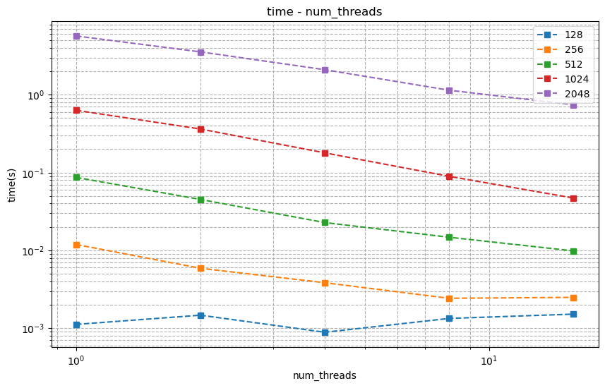
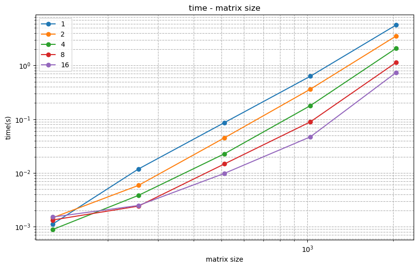
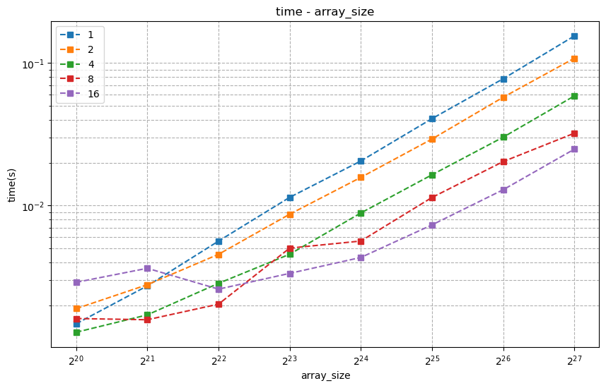
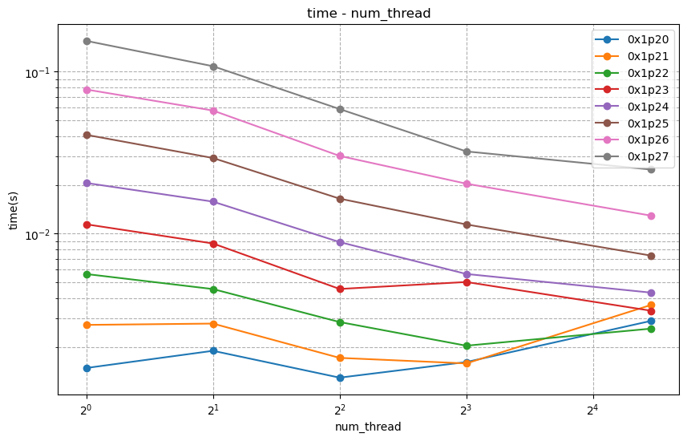

<div class="cover" style="page-break-after:always;font-family:方正公文仿宋;width:100%;height:100%;border:none;margin: 0 auto;text-align:center;">
    <div style="width:50%;margin: 0 auto;height:0;padding-bottom:10%;">
        </br>
        
    </div>
    </br></br>
    <div style="width:40%;margin: 0 auto;height:0;padding-bottom:40%;">
        
    </div>
		</br></br></br>
    <span style="font-family:华文黑体Bold;text-align:center;font-size:20pt;margin: 10pt auto;line-height:30pt;">本科生实验报告</span>
    </br>
    </br>
    <table style="border:none;text-align:center;width:72%;font-family:仿宋;font-size:14px; margin: 0 auto;">
    <tbody style="font-family:方正公文仿宋;font-size:12pt;">
        <tr style="font-weight:normal;"> 
            <td style="width:20%;text-align:center;">实验课程</td>
            <td style="width:40%;font-weight:normal;border-bottom: 1px solid;text-align:center;font-family:华文仿宋">并行程序设计与算法实验</td>
      </tr>
        <tr style="font-weight:normal;"> 
            <td style="width:20%;text-align:center;">实验名称</td>
            <td style="width:40%;font-weight:normal;border-bottom: 1px solid;text-align:center;font-family:华文仿宋">3-Pthreads并行矩阵乘法与数组求和</td>
      </tr>
        <tr style="font-weight:normal;"> 
            <td style="width:20%;text-align:center;">专业名称</td>
            <td style="width:40%;font-weight:normal;border-bottom: 1px solid;text-align:center;font-family:华文仿宋">计算机科学与技术</td>
      </tr>
        <tr style="font-weight:normal;"> 
            <td style="width:20%;text-align:center;">学生姓名</td>
            <td style="width:40%;font-weight:normal;border-bottom: 1px solid;text-align:center;font-family:华文仿宋">李世源</td>
      </tr>
        <tr style="font-weight:normal;"> 
            <td style="width:20%;text-align:center;">学生学号</td>
            <td style="width:40%;font-weight:normal;border-bottom: 1px solid;text-align:center;font-family:华文仿宋">22342043</td>
      </tr>
        <tr style="font-weight:normal;"> 
            <td style="width:20%;text-align:center;">实验地点</td>
            <td style="width:40%;font-weight:normal;border-bottom: 1px solid;text-align:center;font-family:华文仿宋"></td>
      </tr>
        <tr style="font-weight:normal;"> 
            <td style="width:20%;text-align:center;">实验成绩</td>
            <td style="width:40%;font-weight:normal;border-bottom: 1px solid;text-align:center;font-family:华文仿宋"></td>
      </tr>
      <tr style="font-weight:normal;"> 
            <td style="width:20%;text-align:center;">报告时间</td>
            <td style="width:40%;font-weight:normal;border-bottom: 1px solid;text-align:center;font-family:华文仿宋">2025年04月02日</td>
      </tr>
    </tbody>              
    </table>
</div>

<!-- 注释语句：导出PDF时会在这里分页，使用 Typora Newsprint 主题放大 125% -->


# 实验环境

我的测试平台处理器是 Intel Xeon E7 处理器，单槽 16 核，Intel 给出的性能信息如下：

| Processor Group                                              | GFLOPS | APP     |
| ------------------------------------------------------------ | ------ | ------- |
| Intel® Xeon® Processor E7-4830 v3 (30M Cache, 2.10 GHz) E7-4830V3 | 403.2  | 0.12096 |

# 代码介绍

- `test1` 目录下为并行矩阵乘法对 C 按行划分实现。
- `test2` 目录下为并行矩阵乘法对 C 按块划分实现。
- `test3` 目录下为并行数组求和每个线程单独求和，最后相加的实现。
- `test4` 目录下为并行数组求和通过全局求和值及其锁的实现。

`Makefile` 中定义了开发、构建、测试，使用如下：

```shell
# 生成 LSP 配置文件，本实验不需要链接所以这个不太需要
make dev

# 只构建不测试
make build

# 运行单次测试
./build/test1 2048 2048 2048 16  # 并行矩阵乘法
./build/test2 0x1p27 # 并行数组求和, 128M = 0x1p27

# 运行表格上的全部测试，输出表格形式的结果
make test1  # 并行矩阵乘法
make test2  # 并行数组求和

# 清空已构建内容(build 目录)
make clean
```

使用 jupyter notebook 脚本 `draw.ipynb` 根据 `make test1-all` 或 `make test2-all` 输出的结果 (`build/result.md`) 画图，直观展示性能变化情况。实验报告中的曲线图均由该脚本生成。

# 并行矩阵乘法

## 实验要求

使用 Pthreads 实现并行矩阵乘法，并通过实验分析其性能。

**输入**：$m,n,k$ 三个整数，每个整数的取值范围均为 $[128, 2048]$。

**问题描述：**随机生成 $m\times n$ 的矩阵 $A$ 及 $n\times k$ 的矩阵 $B$，并对这两个矩阵进行矩阵乘法运算，得到矩阵 $C$。

**输出**： $A,B,C$ 三个矩阵，及矩阵计算所消耗的时间 $t$。

**要求**：
1. 使用 Pthreads 创建多线程实现并行矩阵乘法，调整线程数量（1-16）及矩阵规模（128-2048），根据结果分析其并行性能（包括但不限于，时间、效率、可扩展性）。
2. 选做：可分析不同数据及任务划分方式的影响。

## 测试分析

按照 A 矩阵行划分计算，得到测试结果如下：

|    |     128     |     256     |     512     |     1024    |     2048    |
|----|-------------|-------------|-------------|-------------|-------------|
|  1 | 1.11776e-03 | 1.18844e-02 | 8.65336e-02 | 6.30368e-01 | 5.68360e+00 |
|  2 | 1.46766e-03 | 5.87945e-03 | 4.50713e-02 | 3.62203e-01 | 3.54966e+00 |
|  4 | 8.85635e-04 | 3.83457e-03 | 2.27392e-02 | 1.78856e-01 | 2.09500e+00 |
|  8 | 1.33344e-03 | 2.41976e-03 | 1.47262e-02 | 8.92969e-02 | 1.14147e+00 |
| 16 | 1.51407e-03 | 2.48741e-03 | 9.83513e-03 | 4.69817e-02 | 7.42013e-01 |

如下是相同矩阵规模下，随着线程数量增大，所消耗时间的变化情况：



对于较小的矩阵（如128×128），线程数量的增加并不总能带来性能提升。当线程从1增加到2时，计算时间反而略有上升，从1.12毫秒增加到1.47毫秒，这可能是因为线程创建和同步的开销超过了并行计算带来的收益。当线程数增加到4时，时间降至0.886毫秒，说明并行化开始发挥作用。然而，继续增加线程至8或16时，时间波动较大，甚至有所回升，这表明对于小矩阵，过多的线程反而可能因管理开销而降低效率。

而对于中等规模的矩阵（如256×256至1024×1024），增加线程数量能显著减少计算时间。例如，在256×256的矩阵上，使用1个线程需要11.88毫秒，而使用16个线程仅需2.49毫秒，加速比约为4.8倍。在1024×1024的矩阵上，加速比更为明显，从单线程的630毫秒降至16线程的47毫秒，加速比高达13.4倍，接近理想的线性加速。

对于更大的矩阵（如2048×2048），线程数量的增加仍然能大幅提升性能，但加速比有所下降。从1个线程的5.68秒减少到16个线程的0.742秒，加速比约为7.7倍。虽然仍然可观，但相比中等规模矩阵的加速比有所降低，这可能是因为大规模计算时内存带宽或缓存竞争成为瓶颈，限制了并行效率的进一步提升。

如下是相同线程数量下，随着矩阵规模增大，所消耗时间的变化情况：



当线程数量固定时，矩阵规模的增大会显著增加计算时间，但多线程能有效缓解这一趋势。

在单线程情况下，矩阵规模从128×128增加到2048×2048（即规模扩大16倍），计算时间从1.12毫秒激增至5.68秒，增长约5000倍，这与矩阵乘法的理论计算复杂度（O(n³)）相符。相比之下，使用16个线程时，同样的规模增长仅使计算时间从1.51毫秒增加到742毫秒，增长约500倍，远低于单线程的增长幅度。这说明多线程能有效降低大规模矩阵计算的时间成本。

此外，对比不同线程数下的表现可以发现，对于小矩阵（如128×128），多线程的优势并不明显，甚至可能因额外开销而变慢。而对于大矩阵（如2048×2048），16个线程的计算速度比单线程快7.7倍，充分体现了并行计算在高计算负载下的优势。

## 选作部分

`test3` 目录下代码为对 C 矩阵按块划分的方式，对于指定的线程数量 num_threads，找到一个最优的线程分配方案，将可用的线程数合理地划分到矩阵的行和列维度上。通过如下函数实现：

```cpp
pair<int, int> get_block_distribution(int num_threads, int M, int N) {
  int best_rows = 1;
  int best_cols = num_threads;
  double best_ratio_diff = fabs(1.0 - (double)(M*best_cols)/(N*best_rows));
  
  // 尝试所有可能的因数分解
  for (int rows = 1; rows <= num_threads; rows++) {
    if (num_threads % rows != 0) continue;
    int cols = num_threads / rows;
    double ratio = (double)(M*cols)/(N*rows);
    double ratio_diff = fabs(1.0 - ratio);
    
    if (ratio_diff < best_ratio_diff) {
      best_ratio_diff = ratio_diff;
      best_rows = rows;
      best_cols = cols;
    }
  }
  
  return {best_rows, best_cols};
}
```

然后修改线程参数和执行函数，使得从原来的仅有 M 行方向上下限增加 N 列方向的上下限。

通过 `make test3` 执行测试，得到结果如下：

|    |     128     |     256     |     512     |     1024    |     2048    |
|----|-------------|-------------|-------------|-------------|-------------|
|  1 | 1.25928e-03 | 1.23125e-02 | 8.46123e-02 | 6.10925e-01 | 7.66041e+00 |
|  2 | 1.24051e-03 | 6.01996e-03 | 4.32853e-02 | 3.44145e-01 | 3.27047e+00 |
|  4 | 7.61935e-04 | 3.91000e-03 | 2.41941e-02 | 1.82563e-01 | 1.73377e+00 |
|  8 | 1.18493e-03 | 3.32915e-03 | 2.15063e-02 | 1.23304e-01 | 1.05725e+00 |
| 16 | 2.16955e-03 | 3.72726e-03 | 1.29559e-02 | 9.16421e-02 | 9.08718e-01 |

此时性能并没有比单纯的按行划分更好，甚至会变得更差，主要是因为划分方式更加复杂，同时按块划分并没有减少总的计算量。相比先前的实验我还尝试了 Cannon 算法减少了进程间通信，此时线程间仅需要传递几个参数而不需要传递矩阵数据，通信开销也没有优化的余地。在这个场景下，原本简单的按行划分实现性能就基本足够好了。

# 并行数组求和

## 实验要求

使用 Pthreads 实现并行数组求和，并通过实验分析其性能。

**输入**：整数 $n$，取值范围为 $[1M, 128M]$。

**问题描述**：随机生成长度为 $n$ 的整型数组 $A$，计算其元素和 $s=\sum_{i=1}^{n}A_i$。

**输出**：数组 $A$，元素和 $s$，及求和计算所消耗的时间 $t$。

**要求**：
1. 使用 Pthreads 实现并行数组求和，调整线程数量（1-16）及数组规模（1M, 128M），根据结果分析其并行性能（包括但不限于，时间、效率、可扩展性）。
2. 选做：可分析不同聚合方式的影响。

## 测试分析

均分数组，每个线程单独求和，最后相加实现，得到测试结果如下：

|        |      1      |      2      |      4      |      8      |      16     |
|--------|-------------|-------------|-------------|-------------|-------------|
| 0x1p20 | 1.10400e-06 | 5.55251e-04 | 5.59114e-04 | 1.17801e-03 | 2.25172e-03 |
| 0x1p21 | 6.13000e-07 | 4.57030e-04 | 5.70218e-04 | 1.15222e-03 | 2.08686e-03 |
| 0x1p22 | 6.38000e-07 | 4.02528e-04 | 5.63820e-04 | 1.05208e-03 | 2.09491e-03 |
| 0x1p23 | 5.30000e-07 | 4.58224e-04 | 6.79106e-04 | 1.08550e-03 | 2.14978e-03 |
| 0x1p24 | 1.00000e-06 | 4.01877e-04 | 5.61176e-04 | 1.06035e-03 | 1.96605e-03 |
| 0x1p25 | 5.46000e-07 | 4.30647e-04 | 5.43453e-04 | 1.21973e-03 | 2.42399e-03 |
| 0x1p26 | 6.20000e-07 | 4.81649e-04 | 4.77018e-04 | 1.09302e-03 | 2.23789e-03 |
| 0x1p27 | 5.57000e-07 | 4.18138e-04 | 6.28650e-04 | 1.20819e-03 | 1.96629e-03 |

如下为固定线程数量，随着数组规模增长，所消耗时间的变化情况：



在固定线程数的条件下（例如4线程），当数组规模从0x1p20扩大到0x1p27时，耗时保持在5.43e-04到6.79e-04秒之间，并未出现明显增长。这说明对于数组求和这类计算密度较低的操作，当数组规模达到一定阈值后，计算时间的增长幅度趋于平缓。值得注意的是，在单线程情况下，不同规模数组的耗时都维持在极低水平（约5e-07到1e-06秒），这验证了简单任务串行执行的高效性。

如下为固定数组规模，随着线程数量增长，所消耗时间的变化情况：



以中等规模数组（如0x1p22）为例，单线程运行时耗时仅为6.38e-07秒，但当线程数增加到16个时，耗时反而增长到2.09e-03秒，呈现明显的性能下降趋势。这种反直觉的现象揭示了并行计算中线程调度的开销问题——当计算任务本身不够繁重时，创建和管理多个线程的开销甚至会超过并行计算带来的收益。特别是在小规模数组（如0x1p20）上，这种线程开销的负面影响更为显著，16线程的耗时达到单线程的2000倍以上。

为了减少线程切换的开销，我增加了代码显式的绑核操作，main 函数一开始就绑核到 0 号核上，每创建一个线程就绑定到一个不同的核上。尽管如此，上述现象并没有发生改变，说明在这个场景下，线程切换的开销远超过了数据任务的开销，除非数据任务更加庞大复杂超过线程切换开销，否则无法避免这样的现象。

## 选作部分

`test4` 目录下代码为设置一个全局求和值，每一个线程都向该值做加法。为了防止线程间争夺这个值产生冒险，还需要设置锁。每一次做加法都需要先（等待锁空闲）上锁，做完加法后解锁。

通过 `make test4` 执行测试，得到结果如下：

|        |      1      |      2      |      4      |      8      |      16     |
|--------|-------------|-------------|-------------|-------------|-------------|
| 0x1p20 | 1.53400e-06 | 4.36329e-04 | 5.94294e-04 | 1.20688e-03 | 2.27984e-03 |
| 0x1p21 | 1.82400e-06 | 3.54933e-04 | 5.26300e-04 | 1.08156e-03 | 2.19736e-03 |
| 0x1p22 | 1.56600e-06 | 3.74218e-04 | 5.23571e-04 | 1.10153e-03 | 2.09218e-03 |
| 0x1p23 | 1.36400e-06 | 3.09327e-04 | 5.06420e-04 | 1.05543e-03 | 2.12955e-03 |
| 0x1p24 | 1.55700e-06 | 3.50873e-04 | 5.36847e-04 | 9.94712e-04 | 2.55879e-03 |
| 0x1p25 | 1.52600e-06 | 4.08960e-04 | 6.58260e-04 | 1.15856e-03 | 2.16493e-03 |
| 0x1p26 | 1.43600e-06 | 3.27288e-04 | 5.55086e-04 | 1.14773e-03 | 2.45791e-03 |
| 0x1p27 | 1.52400e-06 | 3.40839e-04 | 5.42333e-04 | 1.10732e-03 | 2.28802e-03 |

对比原本的实现，性能要更差一些，显然是因为围绕锁的操作引入了新的开销。对于这个数组求和场景，原本每一个线程单独求和，最后相加的方式是开销最小的，没有必要使用锁。