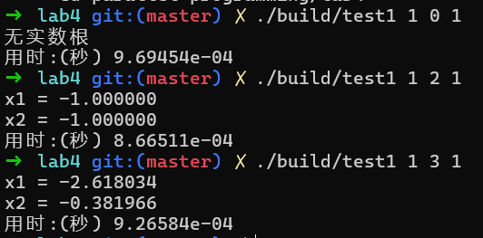
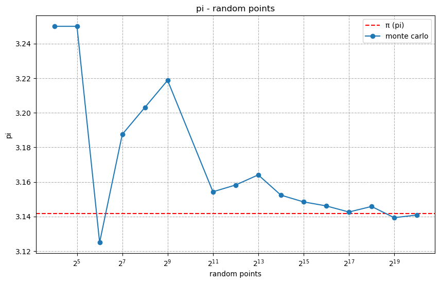
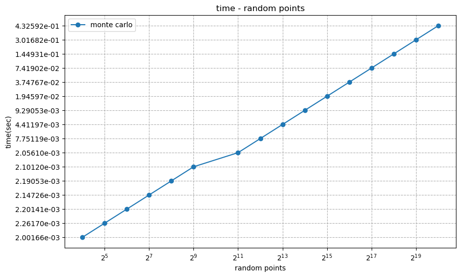

<div class="cover" style="page-break-after:always;font-family:方正公文仿宋;width:100%;height:100%;border:none;margin: 0 auto;text-align:center;">
    <div style="width:50%;margin: 0 auto;height:0;padding-bottom:10%;">
        </br>
        
    </div>
    </br></br>
    <div style="width:40%;margin: 0 auto;height:0;padding-bottom:40%;">
        
    </div>
		</br></br></br>
    <span style="font-family:华文黑体Bold;text-align:center;font-size:20pt;margin: 10pt auto;line-height:30pt;">本科生实验报告</span>
    </br>
    </br>
    <table style="border:none;text-align:center;width:72%;font-family:仿宋;font-size:14px; margin: 0 auto;">
    <tbody style="font-family:方正公文仿宋;font-size:12pt;">
        <tr style="font-weight:normal;"> 
            <td style="width:20%;text-align:center;">实验课程</td>
            <td style="width:40%;font-weight:normal;border-bottom: 1px solid;text-align:center;font-family:华文仿宋">并行程序设计与算法实验</td>
      </tr>
        <tr style="font-weight:normal;"> 
            <td style="width:20%;text-align:center;">实验名称</td>
            <td style="width:40%;font-weight:normal;border-bottom: 1px solid;text-align:center;font-family:华文仿宋">4-Pthreads并行方程求解及蒙特卡洛</td>
      </tr>
        <tr style="font-weight:normal;"> 
            <td style="width:20%;text-align:center;">专业名称</td>
            <td style="width:40%;font-weight:normal;border-bottom: 1px solid;text-align:center;font-family:华文仿宋">计算机科学与技术</td>
      </tr>
        <tr style="font-weight:normal;"> 
            <td style="width:20%;text-align:center;">学生姓名</td>
            <td style="width:40%;font-weight:normal;border-bottom: 1px solid;text-align:center;font-family:华文仿宋">李世源</td>
      </tr>
        <tr style="font-weight:normal;"> 
            <td style="width:20%;text-align:center;">学生学号</td>
            <td style="width:40%;font-weight:normal;border-bottom: 1px solid;text-align:center;font-family:华文仿宋">22342043</td>
      </tr>
        <tr style="font-weight:normal;"> 
            <td style="width:20%;text-align:center;">实验地点</td>
            <td style="width:40%;font-weight:normal;border-bottom: 1px solid;text-align:center;font-family:华文仿宋"></td>
      </tr>
        <tr style="font-weight:normal;"> 
            <td style="width:20%;text-align:center;">实验成绩</td>
            <td style="width:40%;font-weight:normal;border-bottom: 1px solid;text-align:center;font-family:华文仿宋"></td>
      </tr>
      <tr style="font-weight:normal;"> 
            <td style="width:20%;text-align:center;">报告时间</td>
            <td style="width:40%;font-weight:normal;border-bottom: 1px solid;text-align:center;font-family:华文仿宋">2025年04月12日</td>
      </tr>
    </tbody>              
    </table>
</div>

<!-- 注释语句：导出PDF时会在这里分页，使用 Typora Newsprint 主题放大 125% -->


# 实验环境

我的测试平台处理器是 Intel Xeon E7 处理器，单槽 16 核，Intel 给出的性能信息如下：

| Processor Group                                              | GFLOPS | APP     |
| ------------------------------------------------------------ | ------ | ------- |
| Intel® Xeon® Processor E7-4830 v3 (30M Cache, 2.10 GHz) E7-4830V3 | 403.2  | 0.12096 |

# 代码介绍

- `test1` 目录下为并行矩阵乘法对 C 按行划分实现。
- `test2` 目录下为并行矩阵乘法对 C 按块划分实现。
- `test3` 目录下为并行数组求和每个线程单独求和，最后相加的实现。
- `test4` 目录下为并行数组求和通过全局求和值及其锁的实现。

`Makefile` 中定义了开发、构建、测试，使用如下：

```shell
# 生成 LSP 配置文件，本实验不需要链接所以这个不太需要
make dev

# 只构建不测试
make build

# 运行单次测试
./build/test1 1 2 1     # 求 x^2 + 2 * x + 1 = 0 的根
./build/test2 0x1p16 16 # 16 线程 65536 = 0x1p16 个随机点用蒙特卡洛计算 pi

# 批量运行蒙特卡洛计算 pi
make test2  # 并行数组求和

# 清空已构建内容(build 目录)
make clean
```

使用 jupyter notebook 脚本 `draw.ipynb` 根据 `make test2` 输出的结果 (`build/result.md`) 画图，直观展示蒙特卡洛计算结果的变化情况。实验报告中的曲线图由该脚本生成。

# 1. 一元二次方程求解

## 实验要求

使用 Pthread 编写多线程程序，求解一元二次方程组的根，结合数据及任务之间的依赖关系，及实验计时，分析其性能。

一元二次方程：为包含一个未知项，且未知项最高次数为二的整式方程式，常写作 $ax^2+bx+c=0$ ，其中 $x$ 为未知项，$a,b,c$ 为三个常数。

一元二次方程的解：一元二次方程的解可由求根公式给出： 

$$
x=\frac{-b\pm\sqrt{b^2-4ac}}{2a}
$$

**输入**：$a,b,c$ 三个浮点数，其的取值范围均为 $[-100, 100]$

**问题描述**：使用求根公式并行求解一元二次方程 $ax^2+bx+c=0$。

**输出**：方程的解 $x_1,x_2$，及求解所消耗的时间 $t$。

**要求**：使用 Pthreads 编写多线程程序，根据求根公式求解一元二次方程。求根公式的中间值由不同线程计算，并使用条件变量识别何时线程完成了所需计算。讨论其并行性能。

## 代码实现

变量定义与初始化

```c
double a, b, c;       // 二次方程系数
double delta;         // 判别式 sqrt(b² - 4ac)
double root1, root2;  // 方程的两个根
bool delta_ready = false;  // 标记 delta 是否计算完成
bool has_real_roots;  // 标记是否有实数根

pthread_cond_t cond_delta_ready = PTHREAD_COND_INITIALIZER;  // 条件变量，用于通知 delta 计算完成
pthread_mutex_t mutex1 = PTHREAD_MUTEX_INITIALIZER;  // 保护 root1 计算
pthread_mutex_t mutex2 = PTHREAD_MUTEX_INITIALIZER;  // 保护 root2 计算
```

- **`delta_ready`** 是一个标志，表示 `delta` 是否计算完成。  
- **`cond_delta_ready`** 是一个条件变量，用于在 `delta` 计算完成后唤醒等待的线程。  
- **`mutex1` 和 `mutex2`** 分别用于保护 `root1` 和 `root2` 的计算，确保它们不会在 `delta` 计算完成前执行。  


`calc_delta` 线程用于计算判别式：

```c
void *calc_delta(void *_) {
  pthread_mutex_lock(&mutex1);  // 锁住 mutex1（防止 root1 提前计算）
  pthread_mutex_lock(&mutex2);  // 锁住 mutex2（防止 root2 提前计算）
  
  double d = b * b - 4 * a * c;
  delta = sqrt(d); // 计算判别式
  has_real_roots = d >= 0; // 检查是否有实数根
  
  delta_ready = true;  // 标记 delta 计算完成
  
  pthread_cond_signal(&cond_delta_ready);  // 唤醒等待 cond_delta_ready 的线程（root1）
  pthread_mutex_unlock(&mutex1);  // 释放 mutex1，允许 root1 计算
  
  pthread_cond_signal(&cond_delta_ready);  // 再次唤醒（确保 root2 也被唤醒）
  pthread_mutex_unlock(&mutex2);  // 释放 mutex2，允许 root2 计算
  
  pthread_exit(NULL);
}
```

- **先锁 `mutex1` 和 `mutex2`**，确保 `root1` 和 `root2` 线程不会提前执行。  
- **计算 `delta`**，并检查是否有实数根。  
- **设置 `delta_ready = true`**，表示 `delta` 已计算完成。  
- **发送 `pthread_cond_signal` 两次**：
	- 第一次唤醒 `root1`（等待 `mutex1` 的线程）。
	- 第二次唤醒 `root2`（等待 `mutex2` 的线程）。
- **释放 `mutex1` 和 `mutex2`**，让 `root1` 和 `root2` 可以继续执行。  

`calc_root1` 线程和 `calc_root2` 线程计算 2 个根。代码逻辑基本一致，以 `calc_root1` 线程为例：

```c
void *calc_root1(void *_) {
  pthread_mutex_lock(&mutex1);  // 尝试获取 mutex1
  
  while (!delta_ready)  // 如果 delta 还没计算完，就等待
    pthread_cond_wait(&cond_delta_ready, &mutex1);  // 释放 mutex1，并阻塞直到被唤醒
  
  root1 = (-b - delta) / (2 * a);  // 计算第一个根
  
  pthread_exit(NULL);
}
```

- **先获取 `mutex1`**，防止其他线程修改 `delta`。  
- **检查 `delta_ready`**：
	- 如果 `delta` 还没计算完，调用 `pthread_cond_wait` **释放 `mutex1`** 并阻塞，直到 `calc_delta` 线程唤醒它。  
- **被唤醒后重新获取 `mutex1`**，然后计算 `root1`。  


主线程如下：

```c
int main(int argc, char *argv[]) {
  bind_thread_to_cpu(pthread_self(), 0);  // 主线程绑定到 CPU 0
  
  a = atof(argv[1]);  // 解析命令行参数
  b = atof(argv[2]);
  c = atof(argv[3]);
  
  pthread_t threads[3];
  
  pthread_create(&threads[0], NULL, calc_delta, NULL);  // 启动 delta 计算线程
  bind_thread_to_cpu(threads[0], 1);  // 绑定到 CPU 1
  
  pthread_create(&threads[1], NULL, calc_root1, NULL);  // 启动 root1 计算线程
  bind_thread_to_cpu(threads[1], 2);  // 绑定到 CPU 2
  
  pthread_create(&threads[2], NULL, calc_root2, NULL);  // 启动 root2 计算线程
  bind_thread_to_cpu(threads[2], 3);  // 绑定到 CPU 3
  
  for (int i = 0; i < 3; i++)  // 等待所有线程完成
    pthread_join(threads[i], NULL);
  
  if (has_real_roots) {  // 输出结果
    printf("x1 = %lf\n", root1);
    printf("x2 = %lf\n", root2);
  } else {
    printf("无实数根\n");
  }
  
  return 0;
}
```

其代码逻辑也就是我的程序主要逻辑如下：
1. 主线程绑定到 CPU 0，其他线程绑定到不同的 CPU（1、2、3），以最大化并行性能。  
2. 启动 3 个线程：
	- `calc_delta`（计算判别式）
	- `calc_root1`（计算第一个根）
	- `calc_root2`（计算第二个根）
3. 等待所有线程完成（`pthread_join`）。  
4. 输出结果（如果有实数根）。  

## 性能分析

对无实数根、两个根相同、两个根不同的情况测试如下：



我的代码中每个线程绑定到不同的 CPU，减少线程切换开销。`root1` 和 `root2` 可以在 `delta` 计算完成后同时计算因为它们依赖的是只读的数据，而他们所写的数据则互不干扰。

但是在这个场景中并行加速可能不明显，求根的计算任务非常简单，线程创建和同步的开销可能超过并行计算的收益。但该模式可以扩展至更复杂的计算任务（如矩阵运算、数值模拟等）。

# 2. 蒙特卡洛方法求 $\pi$ 的近似值

基于 Pthreads 编写多线程程序，使用蒙特卡洛方法求圆周率 $\pi$ 近似值。

蒙特卡洛方法与圆周率近似：蒙特卡洛方法是一种基于随机采样的数值计算方法，通过模拟随机时间的发生，来解决各类数学、物理和工程上的问题，尤其是直接解析解决困难或无法求解的问题。其基本思想是：当问题的确切解析解难以获得时，可以通过随机采样的方式，生成大量的模拟数据，然后利用这些数据的统计特性来近似求解问题。在计算圆周率 $\pi$ 值时，可以随机地将点撒在一个正方形内。当点足够多时，总采样点数量与落在内切圆内采样点数量的比例将趋近于 $\frac{\pi}{4}$，可据此来估计 $\pi$ 的值。

**输入**：整数 $n$，取值范围为 $[1024, 65536]$

**问题描述**：随机生成正方形内的 $n$ 个采样点，并据此估算 $\pi$ 的值。

**输出**：总点数 $n$，落在内切圆内点数 $m$，估算的 $\pi$ 值，及消耗的时间 $t$。

**要求**：基于 Pthreads 编写多线程程序，使用蒙特卡洛方法求圆周率 $\pi$ 近似值。讨论程序并行性能。

## 代码实现

数据结构 `Args`：

```c
typedef struct {
  int count_all;      // 该线程需要计算的总点数
  int count_inside;   // 该线程统计的圆内点数
} Args;
```
- `count_all`：每个线程负责计算的点数。
- `count_inside`：该线程统计的落在圆内的点数。

在接下来的线程计算函数中，我设计了两种计算函数，分别根据随机数作为不同的数据类型进行计算。

首先是基于 int 类型的计算函数 `calc_by_int` 如下：

```c
void *calc_by_int(void* arg) {
  Args* args = (Args*)arg;
  uint64_t x, y;  // 使用 64 位整数避免溢出
  for (int i = 0; i < args->count_all; i++) {
    x = rand();  // 生成随机 x ∈ [0, RAND_MAX]
    y = rand();  // 生成随机 y ∈ [0, RAND_MAX]
    if (x * x + y * y <= QUADRA_RAND_MAX_INT) {  // 检查是否在圆内
      args->count_inside += 1;
    }
  }
  return NULL;
}
```

`RAND_MAX` 的值为伪随机数生成器能产生的最大整数值，为 `0x7fff`。我直接使用生成的随机数作为坐标值的话，为了确保 `x * x + y * y` 不会溢出，我计算了 `QUADRA_RAND_MAX_INT = RAND_MAX * RAND_MAX` 等于 `0x3fffffff00000001`，这个值依然能被 64 位二进制表示，所以不会溢出。因此就用 `x * x + y * y <= QUADRA_RAND_MAX_INT` 检查生成的坐标是否在圆内。

然后是基于浮点类型的计算函数 `calc_by_double` 如下：

```c
void *calc_by_double(void* arg) {
  Args* args = (Args*)arg;
  double x, y;
  for (int i = 0; i < args->count_all; i++) {
    x = static_cast<double>(rand());  // x ∈ [0, 1]
    y = static_cast<double>(rand());  // y ∈ [0, 1]
    if (x * x + y * y <= QUADRA_RAND_MAX_DOUBLE) {  // 检查是否在单位圆内
      args->count_inside += 1;
    }
  }
  return NULL;
}
```

这里随机数生成器生成的数直接转化为浮点数类型，转化的范围为 $[0,1]$。所以这里 `QUADRA_RAND_MAX_DOUBLE` 为 `1.0`，用 `x * x + y * y <= QUADRA_RAND_MAX_DOUBLE` 检查生成的坐标是否在圆内。


最后是 `main` 函数的代码实现如下：
```c
int main(int argc, char *argv[]) {
  bind_thread_to_cpu(pthread_self(), 0);  // 主线程绑定到 CPU 0

  int count_all = atoi(argv[1]);          // 总点数
  int num_threads = atoi(argv[2]);        // 线程数
  int count_all_each = count_all / num_threads;  // 每个线程计算的点数

  pthread_t *threads = (pthread_t *)malloc(num_threads * sizeof(pthread_t));
  Args *thread_args = (Args *)malloc(num_threads * sizeof(Args));

  // 创建并绑定子线程
  for (int i = 1; i < num_threads; i++) {
    thread_args[i].count_all = count_all_each;
    thread_args[i].count_inside = 0;
    pthread_create(&threads[i], NULL, calc_by_int, &thread_args[i]);
    bind_thread_to_cpu(threads[i], i);  // 绑定到 CPU i
  }

  // 主线程也参与计算（减少线程切换开销）
  thread_args[0].count_all = count_all_each;
  thread_args[0].count_inside = 0;
  calc_by_int(&thread_args[0]);  // 主线程直接计算
  count_inside = thread_args[0].count_inside;

  // 等待所有子线程完成，并累加结果
  for (int i = 1; i < num_threads; i++) {
    pthread_join(threads[i], NULL);
    count_inside += thread_args[i].count_inside;
  }

  // 计算并输出 π 的近似值
  printf("%lf\n", 4 * static_cast<double>(count_inside) / count_all);
  return 0;
}
```

## 测试分析

某次运行 `make test2` 批量计算（`0x1p04=16` 到 `0x1p20=1048576` 个随机点坐标）得到估算 $\pi$ 的结果表格如下：

|        | monte carlo |
|--------|-------------|
| 0x1p04 | 3.250000000 |
| 0x1p05 | 3.250000000 |
| 0x1p06 | 3.125000000 |
| 0x1p07 | 3.187500000 |
| 0x1p08 | 3.203125000 |
| 0x1p09 | 3.218750000 |
| 0x1p11 | 3.154296875 |
| 0x1p12 | 3.158203125 |
| 0x1p13 | 3.164062500 |
| 0x1p14 | 3.152343750 |
| 0x1p15 | 3.148437500 |
| 0x1p16 | 3.146118164 |
| 0x1p17 | 3.142578125 |
| 0x1p18 | 3.145797729 |
| 0x1p19 | 3.139312744 |
| 0x1p20 | 3.140846252 |

画出其可视化的直观曲线图如下：



- 随机点坐标较少时（$N < 2^{10}$）：结果波动剧烈，误差可能高达 $0.1$，甚至因随机性偶然更接近 $\pi$（如 $N=64$）。
- 随机点坐标较多（$N \geq 2^{16}$）：误差稳定在 $0.001$ 量级，收敛至 $3.141$ 附近。

影响估算结果的因素还有伪随机数生成器的局限性，`rand()` 生成的伪随机数可能存在周期性或相关性，影响高精度计算。此外，就算随机数生成器真的是完全随机的真随机数生成器，生成的随机数无论是浮点数还是整数，取值范围都是离散有限的，例如 31 位随机整数实际上是在 $2^31-1$ 个数中随机取值，并不是理想的连续实数轴上的随机数。

而对于程序的并行性能，代码实现中将所有数据均分给每一个线程，并且每个线程自己求和，最后再汇总，实现无数据竞争冒险的完全并行，通信开销也最小。如下是计算时间随计算规模的变化情况图：



在计算 `0x1p20=1048576` 个随机点时，所需时间仍不超过 1 秒。