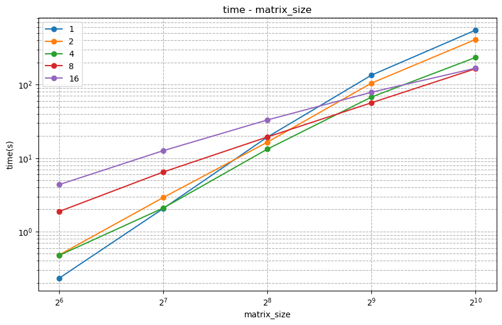
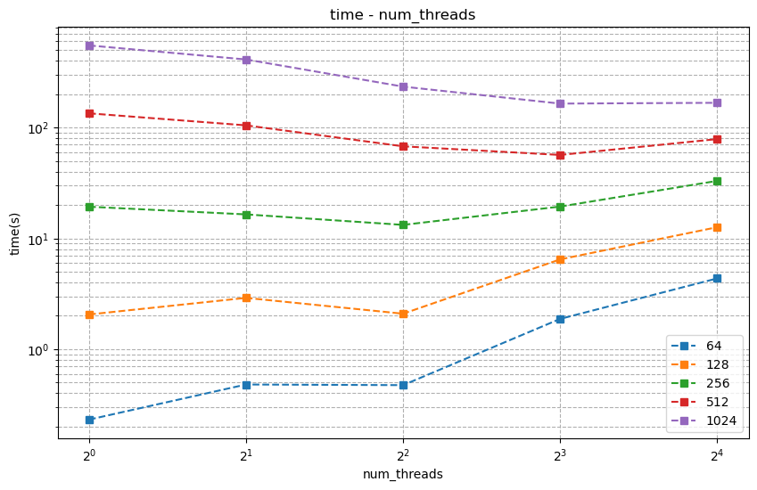
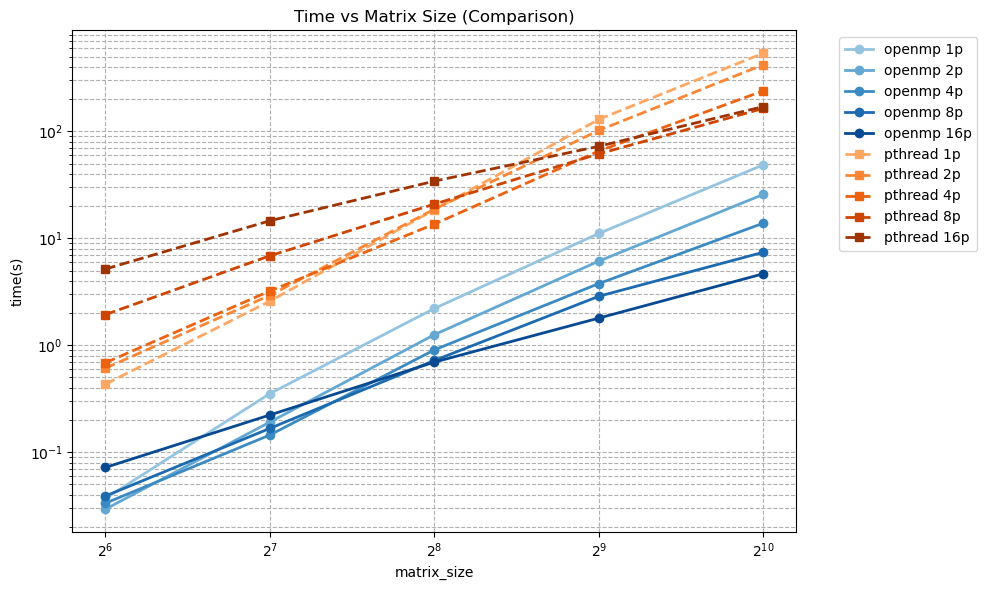

<div class="cover" style="page-break-after:always;font-family:方正公文仿宋;width:100%;height:100%;border:none;margin: 0 auto;text-align:center;">
    <div style="width:50%;margin: 0 auto;height:0;padding-bottom:10%;">
        </br>
        
    </div>
    </br></br>
    <div style="width:40%;margin: 0 auto;height:0;padding-bottom:40%;">
        
    </div>
		</br></br></br>
    <span style="font-family:华文黑体Bold;text-align:center;font-size:20pt;margin: 10pt auto;line-height:30pt;">本科生实验报告</span>
    </br>
    </br>
    <table style="border:none;text-align:center;width:72%;font-family:仿宋;font-size:14px; margin: 0 auto;">
    <tbody style="font-family:方正公文仿宋;font-size:12pt;">
        <tr style="font-weight:normal;"> 
            <td style="width:20%;text-align:center;">实验课程</td>
            <td style="width:40%;font-weight:normal;border-bottom: 1px solid;text-align:center;font-family:华文仿宋">并行程序设计与算法实验</td>
      </tr>
        <tr style="font-weight:normal;"> 
            <td style="width:20%;text-align:center;">实验名称</td>
            <td style="width:40%;font-weight:normal;border-bottom: 1px solid;text-align:center;font-family:华文仿宋">6-Pthreads 并行构造</td>
      </tr>
        <tr style="font-weight:normal;"> 
            <td style="width:20%;text-align:center;">专业名称</td>
            <td style="width:40%;font-weight:normal;border-bottom: 1px solid;text-align:center;font-family:华文仿宋">计算机科学与技术</td>
      </tr>
        <tr style="font-weight:normal;"> 
            <td style="width:20%;text-align:center;">学生姓名</td>
            <td style="width:40%;font-weight:normal;border-bottom: 1px solid;text-align:center;font-family:华文仿宋">李世源</td>
      </tr>
        <tr style="font-weight:normal;"> 
            <td style="width:20%;text-align:center;">学生学号</td>
            <td style="width:40%;font-weight:normal;border-bottom: 1px solid;text-align:center;font-family:华文仿宋">22342043</td>
      </tr>
        <tr style="font-weight:normal;"> 
            <td style="width:20%;text-align:center;">实验地点</td>
            <td style="width:40%;font-weight:normal;border-bottom: 1px solid;text-align:center;font-family:华文仿宋"></td>
      </tr>
        <tr style="font-weight:normal;"> 
            <td style="width:20%;text-align:center;">实验成绩</td>
            <td style="width:40%;font-weight:normal;border-bottom: 1px solid;text-align:center;font-family:华文仿宋"></td>
      </tr>
      <tr style="font-weight:normal;"> 
            <td style="width:20%;text-align:center;">报告时间</td>
            <td style="width:40%;font-weight:normal;border-bottom: 1px solid;text-align:center;font-family:华文仿宋">2025年04月23日</td>
      </tr>
    </tbody>              
    </table>
</div>


<!-- 注释语句：导出PDF时会在这里分页，使用 Typora Newsprint 主题放大 125% -->


# 实验环境

我的测试平台处理器是 Intel Xeon E7 处理器，单槽 16 核，Intel 给出的性能信息如下：

| Processor Group                                              | GFLOPS | APP     |
| ------------------------------------------------------------ | ------ | ------- |
| Intel® Xeon® Processor E7-4830 v3 (30M Cache, 2.10 GHz) E7-4830V3 | 403.2  | 0.12096 |

# 代码介绍

- `lib` 目录下为 `parallel_for` 和相关辅助代码的实现。
- `src` 目录下为 heated plate 问题的模拟程序实现。

`Makefile` 中定义了开发、构建、测试，使用如下：

```shell
# 生成 LSP 配置文件，本实验 Pthreads 不需要链接所以这个不太需要
make dev

# 构建带符号表的程序用于 debug
make debug

# 构建程序
make release

# 运行全部测试
make test

# 单独运行程序
./build/heated_plate

# 清空已构建内容
make clean
```

使用 jupyter notebook 脚本 `draw.ipynb` 根据 `make test` 输出的结果 (`build/result.md`) 画图，直观展示测试结果随相关参数的变化情况。实验报告中的曲线图由该脚本生成。

# 实验要求

使用此前构造的 `parallel_for` 并行结构，将 `heated_plate_openmp` 改造为基于 Pthreads 的并行应用。

**heated plate 问题描述**：规则网格上的热传导模拟，其具体过程为每次循环中通过对邻域内热量平均模拟热传导过程，即：

$$
w_{i,j}^{t+1}=\frac{1}{4} ( w_{i-1,j-1}^t + w_{i-1,j+1}^t + w_{i+1,j-1}^t + w_{i+1,j+1}^t )
$$

其 OpenMP 实现见课程资料中的 `heated_plate_openmp.c`。

**要求**：使用此前构造的 `parallel_for` 并行结构，将 `heated_plate_openmp` 实现改造为基于 Pthreads 的并行应用。测试不同线程、调度方式下的程序并行性能，并与原始 `heated_plate_openmp.c` 实现对比。

# 代码实现

## 调度模式

在我的程序实现中，我设计了 2 种调度模式：
- 静态调度实现:
  - 计算总迭代次数
  - 将迭代次数平均分配给各线程(剩余迭代分配给前几个线程)
  - 为每个线程设置迭代范围( `start-end` )
- 动态调度实现:
  - 初始化互斥锁和共享变量 `next_iter`
  - 所有线程共享相同的循环范围
  - 线程通过互斥锁获取下一个迭代块
  - 执行完当前块后继续获取新块，直到迭代完成

按照上述设计，构建线程参数结构体 `thread_arg_t`：

```c
typedef struct {
  int start;          // 循环起始值
  int end;            // 循环结束值
  int inc;            // 循环增量
  void *(*functor)(int, void*); // 循环体函数指针
  void *arg;          // 传递给循环体函数的参数
  int chunk_size;     // 动态调度时的块大小
  int schedule_type;  // 调度方式(0:静态, 1:动态)
  pthread_mutex_t *mutex; // 动态调度使用的互斥锁
  int *next_iter;     // 动态调度使用的下一个迭代指针
} thread_arg_t;
```

对于静态调度，实现传递给 `pthread_create` 的工作函数 `thread_work_static`：

```c
static void* thread_work_static(void *arg) {
  thread_arg_t *t_arg = (thread_arg_t*)arg;
  
  // 简单地执行分配给该线程的迭代范围
  for (int i = t_arg->start; i < t_arg->end; i += t_arg->inc) {
    t_arg->functor(i, t_arg->arg);
  }
  
  return NULL;
}
```

对于动态调度，实现传递给 `pthread_create` 的工作函数 `thread_work_dynamic`：

```c
static void* thread_work_dynamic(void *arg) {
  thread_arg_t *t_arg = (thread_arg_t*)arg;
  int chunk = t_arg->chunk_size;
  int current_iter;
  
  while (1) {
    // 使用互斥锁保护共享变量next_iter
    pthread_mutex_lock(t_arg->mutex);
    current_iter = *(t_arg->next_iter);
    *(t_arg->next_iter) += chunk * t_arg->inc;
    pthread_mutex_unlock(t_arg->mutex);
    
    // 检查是否超出范围
    if (current_iter >= t_arg->end) break;
    
    // 执行当前迭代块
    int end_iter = current_iter + chunk * t_arg->inc;
    if (end_iter > t_arg->end) end_iter = t_arg->end;
    
    for (int i = current_iter; i < end_iter; i += t_arg->inc) {
      t_arg->functor(i, t_arg->arg);
    }
  }
  
  return NULL;
}
```

## 支持累加

和上一个实验不同的是，这次实验中还需要支持类似 OpenMP 中的 `#pragma omp for reduction ( + : mean )` 这样的功能。由于 “累加” 被并行化为 “分别累加” -> “最后相加”，而 “分别累加” 这个过程已经在传递给 `parallel_for` 的作为函数指针参数的函数中完成了，还需要支持 “最后相加” 这个行为。这个行为必须是串行化的，恰好可以放在结束时的 join 阶段。在这个阶段让每个线程都执行一遍特定的操作就行，这个操作需要能够被自定义，因此，我利用 C++ 的类，将传递给线程的 C 风格参数结构体替换为类，并且规定所有这些参数结构体基于如下的虚类：

```cpp
class ArgInterface {
public:
  // 这个函数在 join 阶段调用,保证是线程安全的
  virtual void converge() = 0;

  virtual ArgInterface * clone() = 0;
};
```

这样处理的思路是来源于其他编程语言中的 `interface` 接口，我希望所有参数结构体都实现上述两个函数，这样就能在使用我的 `parallel_for` 时自定义 “累加” 行为的 “最后相加” 应该做什么。

同时还有大部分情况是不需要累加的，虚函数重载为空的即可，并且我给 `parallel_for` 增加了一个参数 `bool accumulate`，默认值为假，。于是，join 阶段只需要在 `accumulate` 为真时调用虚函数即可：

```cpp
// 等待所有线程完成
for (int i = 0; i < num_threads; i++) {
	if (i != 0) {
		pthread_join(threads[i], NULL);
	}
	if (accumulate) {
		ArgInterface * arg_interface = (ArgInterface *)thread_args[i].arg;
		arg_interface->converge();
	}
}
```

而之所以要实现 `clone` 这个虚函数，是为了给传递给 `parallel_for` 的单个参数结构体复制多个互不干扰的副本来给线程执行，这样才能保证 “分别累加” 这个行为互不影响。复制参数结构体的部分如下：

```cpp
// ...设置其他参数
if (accumulate) {
	thread_args[i].arg = (void *)((ArgInterface *)arg)->clone();
} else {
	thread_args[i].arg = arg;  // 不需要复制
}
// ...创建线程
```

例如在 heated plate 任务中，我需要 “累加” `mean` 和 `diff`，分别根据它们的行为实现了不同的线程参数。

`mean` 仅需要求和即可，所以实现如下：

```cpp
class ArgWithMean: public Arg {
public:
  double * mean;
  double sub_mean = 0.0;

  void converge() override {
    *mean += sub_mean;
  }

  ArgWithMean* clone() override {
    ArgWithMean * cloned = new ArgWithMean(*this);
    return cloned;
  }
};
```

而 `diff` 则是先在每个线程求自己局部最大的 `diff`，最后求全局最大的 `diff`，所以实现如下：

```cpp
class ArgWithDiff: public Arg {
public:
  double * diff;
  double sub_diff = 0.0;

  void converge() override {
    if ( *diff < sub_diff ) {
      *diff = sub_diff;
    }
  }

  ArgWithDiff* clone() override {
    ArgWithDiff * cloned = new ArgWithDiff(*this);
    return cloned;
  }
};
```

上面的类的继承自 `Arg` 基类。这是因为我对参数结构体封装了一些函数方便对 `u` 和 `w` 矩阵进行赋值和取值的操作在 `Arg` 类中，不同于给出的 OpenMp 实现的程序，我的程序支持输入矩阵的规模，所以 `u` 和 `w` 矩阵是动态定义的，赋值和取值的操作简单的封装一下极大地提升了代码简洁和可读性。

## heated plate

我的 heated plate 模拟程序基本在给出的 OpenMp 版本上修改适配 `parallel_for` 而来。

在修改代码过程中，我也注意到每次 `parallel_for` 函数的调用都会创建一批线程，然后销毁这一批线程。这样的话，原本 OpenMP 中很常见的 `#pragma omp for` 就会在新版本的程序中引入额外的线程创建和销毁开销。最理想的情况是每个线程都定义好自己在整个任务流程中该干什么，什么时候同步一下就可以。但是这次实验要求也不是纯 Pthreads 实现，而是要用 `parallel_for` 函数实现，那这样额外的线程创建和销毁开销就不可避免了。

所以我在修改适程序过程中，尽量减少 `parallel_for` 函数的调用，尽量不引入新的线程创建和销毁开销。

# 性能分析

测试结果如下：

<div style="text-align: center;">
  
  
</div>

在模拟矩阵较小的时候，可以看到线程数量较多反而导致性能较差；当矩阵规模增大，这一现象便翻转过来，线程越多性能越好。仔细考察并行加速效率，例如 1024x1024 规模下，16 线程相比单线程提升速度仅有 5 倍左右，远没有理想的 16 倍加速。

为了更明显地对比 OpenMP 实现版本来展现并行性能，我稍微修改了给出的 `heated_plate_openmp.c`，然后也对不同规模和线程数量进行测试，得到结果和 Pthreads `parallel_for` 实现版本对比如下：



可以看到 Pthreads `parallel_for` 实现版本比 OpenMP 实现版本整体慢了 10 倍左右。

原因主要还是上面所讨论的多余的线程创建和销毁的开销。当我用 perf, mpstat, btop 等工具观察程序运行时情况，除了观察到系统调用开销也相当高之外，还观察到除了一个核 CPU 占用率持续保持 100% 左右之外，其他核的 CPU 占用率基本只有 50% 左右，也就是只有主线程能充分利用 CPU，其他线程有基本一半的时间被阻塞而没有事干，导致了并行效果不如预期。