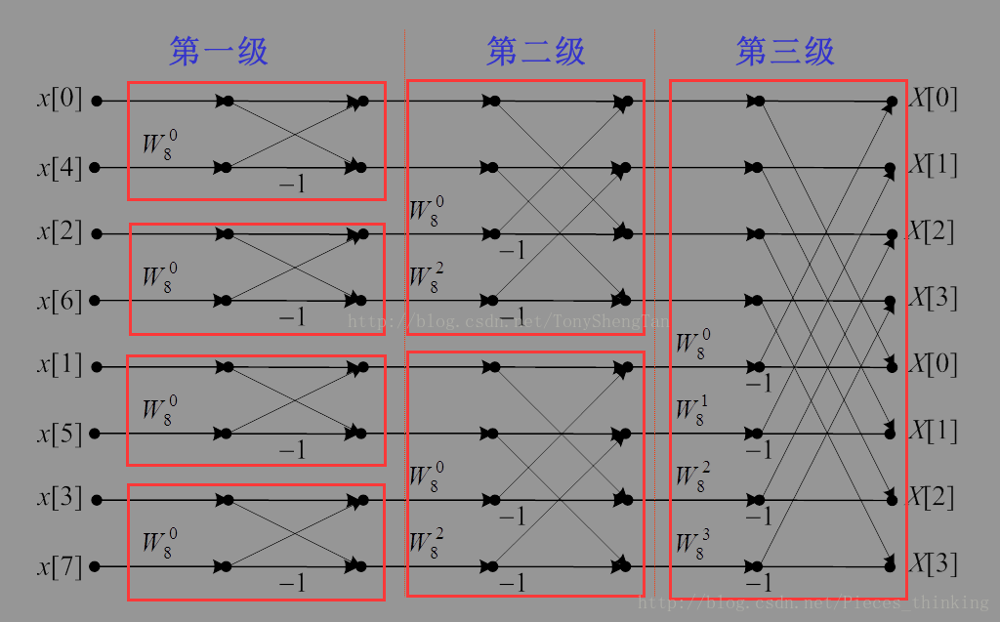

<div class="cover" style="page-break-after:always;font-family:方正公文仿宋;width:100%;height:100%;border:none;margin: 0 auto;text-align:center;">
    <div style="width:50%;margin: 0 auto;height:0;padding-bottom:10%;">
        </br>
        
    </div>
    </br></br>
    <div style="width:40%;margin: 0 auto;height:0;padding-bottom:40%;">
        
    </div>
		</br></br></br>
    <span style="font-family:华文黑体Bold;text-align:center;font-size:20pt;margin: 10pt auto;line-height:30pt;">本科生实验报告</span>
    </br>
    </br>
    <table style="border:none;text-align:center;width:72%;font-family:仿宋;font-size:14px; margin: 0 auto;">
    <tbody style="font-family:方正公文仿宋;font-size:12pt;">
        <tr style="font-weight:normal;"> 
            <td style="width:20%;text-align:center;">实验课程</td>
            <td style="width:40%;font-weight:normal;border-bottom: 1px solid;text-align:center;font-family:华文仿宋">并行程序设计与算法实验</td>
      </tr>
        <tr style="font-weight:normal;"> 
            <td style="width:20%;text-align:center;">实验名称</td>
            <td style="width:40%;font-weight:normal;border-bottom: 1px solid;text-align:center;font-family:华文仿宋">7-MPI并行应用</td>
      </tr>
        <tr style="font-weight:normal;"> 
            <td style="width:20%;text-align:center;">专业名称</td>
            <td style="width:40%;font-weight:normal;border-bottom: 1px solid;text-align:center;font-family:华文仿宋">计算机科学与技术</td>
      </tr>
        <tr style="font-weight:normal;"> 
            <td style="width:20%;text-align:center;">学生姓名</td>
            <td style="width:40%;font-weight:normal;border-bottom: 1px solid;text-align:center;font-family:华文仿宋">李世源</td>
      </tr>
        <tr style="font-weight:normal;"> 
            <td style="width:20%;text-align:center;">学生学号</td>
            <td style="width:40%;font-weight:normal;border-bottom: 1px solid;text-align:center;font-family:华文仿宋">22342043</td>
      </tr>
        <tr style="font-weight:normal;"> 
            <td style="width:20%;text-align:center;">实验地点</td>
            <td style="width:40%;font-weight:normal;border-bottom: 1px solid;text-align:center;font-family:华文仿宋"></td>
      </tr>
        <tr style="font-weight:normal;"> 
            <td style="width:20%;text-align:center;">实验成绩</td>
            <td style="width:40%;font-weight:normal;border-bottom: 1px solid;text-align:center;font-family:华文仿宋"></td>
      </tr>
      <tr style="font-weight:normal;"> 
            <td style="width:20%;text-align:center;">报告时间</td>
            <td style="width:40%;font-weight:normal;border-bottom: 1px solid;text-align:center;font-family:华文仿宋">2025年05月18日</td>
      </tr>
    </tbody>              
    </table>
</div>


<!-- 注释语句：导出PDF时会在这里分页，使用 Typora Newsprint 主题放大 125% -->


# 实验环境

我的测试平台处理器是 Intel Xeon E7 处理器，单槽 16 核，Intel 给出的性能信息如下：

| Processor Group                                              | GFLOPS | APP     |
| ------------------------------------------------------------ | ------ | ------- |
| Intel® Xeon® Processor E7-4830 v3 (30M Cache, 2.10 GHz) E7-4830V3 | 403.2  | 0.12096 |

# 代码介绍

- `lib` 目录下为 `parallel_for` 和相关辅助代码的实现。
- `src` 目录下为 heated plate 问题的模拟程序实现。

`Makefile` 中定义了开发、构建、测试，使用如下：

```shell
# 生成 LSP 配置文件，本实验 Pthreads 不需要链接所以这个不太需要
make dev

# 构建带符号表的程序用于 debug
make debug

# 构建程序
make release

# 运行全部 task2 测试
make task2

# 单独运行程序
mpirun -np 16 ./build-release/task1
./build-release/task2 256 256 16

# 清空已构建内容
make clean
```

使用 jupyter notebook 脚本 `draw.ipynb` 根据 `make task2` 输出的结果 (`build/result.md`) 画图，直观展示测试结果随相关参数的变化情况。实验报告中 task2 的曲线图由该脚本生成。

# 1. MPI 并行应用

## 实验要求

使用 MPI 对快速傅里叶变换进行并行化。

**问题描述**：阅读参考文献中的串行傅里叶变换代码 (`fft_serial.cpp`)，并使用MPI对其进行并行化。

**要求**：并行化：使用 MPI 多进程对 `fft_serial.cpp` 进行并行化。为适应 MPI 的消息传递机制，可能需要对 `fft_serial` 代码进行一定调整。

## 并行化实现

一开始我尝试对给出的参考串行化实现 FFT 进行并行化改造,但仔细研究其代码逻辑,发现它的实现似乎不太方便并行化，假设 $n=8$, 8 个点从 x 到 y 的计算逻辑大致如下图所示:


这和 Binary Exchange 方法并行化的计算逻辑完全不同，除了最后一轮之外每一个进程都要和另外好几个进程通信。因此我的实现重写了计算逻辑，同样假设 $n=8$, 8 个点从 x 到 y 的计算逻辑大致如下图所示:



可以看到图中出现了很多标准的 "X" 形状，这就带来了进程通信的方便，使得每一轮进行数据交换时，每一个进程只需要和另一个进程交换数据。这就是标准的 Binary Exchange 实现的并行化 FFT。算法中，初始分配给所有进程的 x 点的顺序不太一样，这是 FFT 的算法递归处理的原因，每一次递归为 2 个子问题时，下标为偶数的将被映射到自己本身下标的 $\frac{1}{2}$ 处，下表为奇数时被映射到数组后半段的 $\frac{\text{下标}-1}{2}$ 处，将排列后的数据分为前后两个部分，递归次过程，直到只有两个元素，也就是可以直接计算的 n=2 的 FFT 子问题，则停止。以 $n=16$ 为例，上述过程递归 4 次，直观图解大致如下：


我的数据都有 0 号进程产生，我在 `cfft` 函数一开始让 0 号进程中通过同样的递归方法计算这如上的下标的映射，并按照映射后的 `x` 分配给所有进程，所有进程只存储 $np=\frac{n}{p}$ 个点，存储在 `x_local` 中，代码如下：

```cpp
if ( rank == 0 )
{
	idx = new int[n];
	idx[0] = 0;
	
	std::function<void(int[], int, int)> f = [&f](int a[], int size, int k) {
		a[size / 2] = a[0] + k;
		if (size > 2) {
			f(a, size/2, k*2);
			f(a+size/2, size/2, k*2);
		}
	};

	f(idx, n, 1);
	
	for ( int j = 0; j < np; ++j)
	{
		x_local[j + 0] = x[idx[j]*2 + 0];
		x_local[j + 1] = x[idx[j]*2 + 1];
	}

	for ( int i = 1; i < p; ++i)
	{
		for ( int j = 0; j < np; ++j)
		{
			MPI_Send(x+idx[i*np+j]*2, 2, MPI_DOUBLE, i, 0, MPI_COMM_WORLD);
		}
	}

	delete [] idx;
}
else
{
	for ( int j = 0; j < np; ++j)
	{
		MPI_Recv(x_local+j*2, 2, MPI_DOUBLE, 0, 0, MPI_COMM_WORLD, MPI_STATUS_IGNORE);
	}
}
```

我的实现只考虑进程数量 p 小于等于点的数量 n 的情况，并且始终认为 n 和 p 都是 2 的次幂。于是，对于一次 FFT 的每一轮计算，也就是 `step` 函数，就可以分为如下三种情况处理：

- 进程之间不需要通信
- 进程需要通信，并且计算逻辑为每一个点分别加上另一个进程的对应点乘一个 `w[...]`
- 进程需要通信，并且计算逻辑为另一个进程的每一个点分别减去自己的对应点乘一个 `w[...]`

`cfft` 中的总体框架如下：

```cpp
m = ( int ) ( log ( ( double ) n ) / log ( 1.99 ) );
mj2 = 1;
tgle = 0;

for ( j = 0; j < m; j++ )
{
	MPI_Barrier(MPI_COMM_WORLD);
	mj = mj2;
	mj2 = mj2 * 2;
	
	if ( mj2 <= np )  // scene 1
	{
		// ......
	}
	else if ( ( rank * np ) % mj2 < mj )  // scene 2
	{
		// ......
	}
	else  // scene 3
	{
		// ......
	}
	
	step ( n, mj, a, b, c, w, sgn, np, rank );

	tgle = tgle ? 0 : 1;
}

MPI_Gather(tgle ? y_local : x_local, 2 * np, MPI_DOUBLE, y, 2 * np, MPI_DOUBLE, 0, MPI_COMM_WORLD);
```

第一种情况：进程之间不需要通信，`cfft` 函数和 `step` 函数中的处理分别如下：

```cpp
if ( mj2 <= np )  // scene 1
{
	a = tgle ? y_local : x_local;
	b = nullptr;
	c = tgle ? x_local : y_local;
}
```

```cpp
if ( mj2 <= np )  // scene 1
{
	lj = np / mj2;
	
	for ( j = 0; j < lj; j++ )
	{
		jmj2 = j * mj2;

		for ( k = 0; k < mj; k++ )
		{
			wjw[0] = w[(n/mj2)*k*2+0];
			wjw[1] = w[(n/mj2)*k*2+1];

			if ( sgn < 0.0 ) 
			{
				wjw[1] = - wjw[1];
			}

			ambr = wjw[0] * a[(jmj2+mj+k)*2+0] - wjw[1] * a[(jmj2+mj+k)*2+1];
			ambu = wjw[1] * a[(jmj2+mj+k)*2+0] + wjw[0] * a[(jmj2+mj+k)*2+1];

			c[(jmj2   +k)*2+0] = a[(jmj2+k)*2+0] + ambr;
			c[(jmj2   +k)*2+1] = a[(jmj2+k)*2+1] + ambu;
			c[(jmj2+mj+k)*2+0] = a[(jmj2+k)*2+0] - ambr;
			c[(jmj2+mj+k)*2+1] = a[(jmj2+k)*2+1] - ambu;
		}
	}
}
```

第二种情况 `cfft` 函数和 `step` 函数中的处理分别如下：

```cpp
else if ( ( rank * np ) % mj2 < mj )  // scene 2
{
	rk = rank + mj / np;
	a = tgle ? y_local : x_local;
	b = buf;
	c = tgle ? x_local : y_local;

	MPI_Send(a, 2*np, MPI_DOUBLE, rk, rank, MPI_COMM_WORLD);
	MPI_Recv(b, 2*np, MPI_DOUBLE, rk, rk, MPI_COMM_WORLD, MPI_STATUS_IGNORE);
}
```

```cpp
else if ( (rank * np) % mj2 < mj )  // scene 2
{
	for ( k = 0; k < np; k++ )
	{
		wjw[0] = w[(n / mj2) * ((rank * np) % mj + k)*2+0];
		wjw[1] = w[(n / mj2) * ((rank * np) % mj + k)*2+1];

		if ( sgn < 0.0 ) 
		{
			wjw[1] = - wjw[1];
		}
		
		ambr = wjw[0] * b[k*2+0] - wjw[1] * b[k*2+1];
		ambu = wjw[1] * b[k*2+0] + wjw[0] * b[k*2+1];
		
		c[k*2+0] = a[k*2+0] + ambr;
		c[k*2+1] = a[k*2+1] + ambu;
	}
}
```

第三种情况 `cfft` 函数和 `step` 函数中的处理分别如下：

```cpp
else  // scene 3
{
	rk = rank - mj / np;
	a = buf;
	b = tgle ? y_local : x_local;
	c = tgle ? x_local : y_local;

	MPI_Recv(a, 2*np, MPI_DOUBLE, rk, rk, MPI_COMM_WORLD, MPI_STATUS_IGNORE);
	MPI_Send(b, 2*np, MPI_DOUBLE, rk, rank, MPI_COMM_WORLD);
}
```

```cpp
else  // scene 3
{
	for ( k = 0; k < np; k++ )
	{
		wjw[0] = w[(n / mj2) * ((rank * np) % mj + k)*2+0];
		wjw[1] = w[(n / mj2) * ((rank * np) % mj + k)*2+1];

		if ( sgn < 0.0 ) 
		{
			wjw[1] = - wjw[1];
		}

		ambr = wjw[0] * b[k*2+0] - wjw[1] * b[k*2+1];
		ambu = wjw[1] * b[k*2+0] + wjw[0] * b[k*2+1];

		c[k*2+0] = a[k*2+0] - ambr;
		c[k*2+1] = a[k*2+1] - ambu;
	}
}
```

## 分析结果

4 个进程计算结果如下：


8 个进程计算结果如下：


16 个进程计算结果如下：


可以看到随着 n 的增大， MFLOPS 不断增大，说明成功并行化了 FFT 计算任务。

# 2. parallel_for 并行应用分析

## 实验要求

对于 Lab6 实现的 parallel_for 版本 heated_plate_openmp 应用：
- 改变并行规模（线程数）及问题规模（N），分析程序的并行性能，例如问题规模 N，值为 2，4，6，8，16，32，64，128，……；并行规模，值为 1，2，4，8 进程/线程。
- 使用 Valgrind massif 工具集采集并分析并行程序的内存消耗。注意 Valgrind 命令中增加 `--stacks=yes` 参数采集程序运行栈内内存消耗。Valgrind massif 输出日志（massif.out.pid）经过 `ms_print` 打印“统计图”，x 轴为程序运行时间，y 轴为内存消耗量。

## 分析性能

经过调整后，我的 headted_plate_openmp 程序可以通过 `./build-release/task2 512 512 8` 传递参数的形式计算不同规模的问题。测试结果如下：

<div style="text-align: center;">
	
	
</div>

在模拟矩阵较小的时候，可以看到线程数量较多反而导致性能较差；当矩阵规模增大，这一现象便翻转过来，线程越多性能越好。仔细考察并行加速效率，例如 1024x1024 规模下，16 线程相比单线程提升速度仅有 5 倍左右，远没有理想的 16 倍加速。

使用 Valgrind massif 工具集采集并分析并行程序的内存消耗执行指令如下：

```shell
valgrind --tool=massif --stacks=yes ./build-release/task2 256 256 16
```

打印出统计图如下：


结合统计图和分析输出的 `massif.out.xxx` 文件，可以发现随着时间推移，堆内存和栈内存都呈现稳定增长趋势，最终峰值时：
- 堆内存：8.5MB
- 栈内存：46.4MB
- 额外堆内存：1.7MB

主要堆内存分配来自 `ArgWithDiff::clone()` 函数，该函数通过我的 `parallel_for` 函数调用。

同时，栈内存使用量远大于堆内存，可能是因为运行过程反复执行 `parallel_for` 导致大量线程被创建，每个线程有自己的栈，消耗栈内存。
