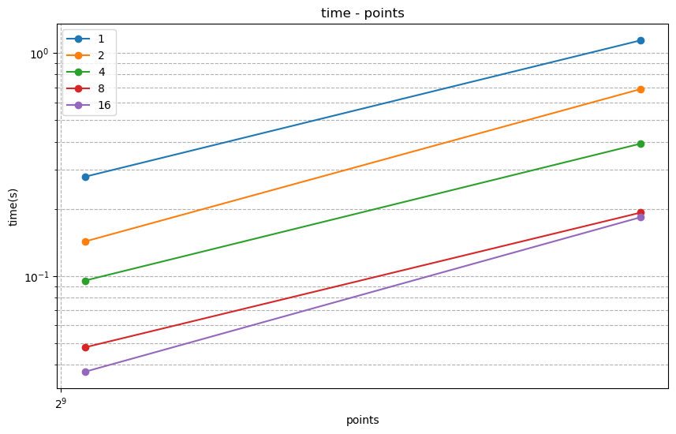
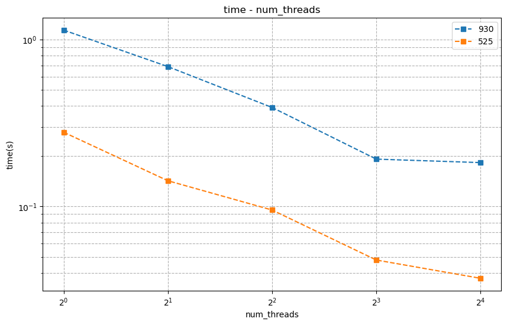

<div class="cover" style="page-break-after:always;font-family:方正公文仿宋;width:100%;height:100%;border:none;margin: 0 auto;text-align:center;">
    <div style="width:50%;margin: 0 auto;height:0;padding-bottom:10%;">
        </br>
        
    </div>
    </br></br>
    <div style="width:40%;margin: 0 auto;height:0;padding-bottom:40%;">
        
    </div>
		</br></br></br>
    <span style="font-family:华文黑体Bold;text-align:center;font-size:20pt;margin: 10pt auto;line-height:30pt;">本科生实验报告</span>
    </br>
    </br>
    <table style="border:none;text-align:center;width:72%;font-family:仿宋;font-size:14px; margin: 0 auto;">
    <tbody style="font-family:方正公文仿宋;font-size:12pt;">
        <tr style="font-weight:normal;"> 
            <td style="width:20%;text-align:center;">实验课程</td>
            <td style="width:40%;font-weight:normal;border-bottom: 1px solid;text-align:center;font-family:华文仿宋">并行程序设计与算法实验</td>
      </tr>
        <tr style="font-weight:normal;"> 
            <td style="width:20%;text-align:center;">实验名称</td>
            <td style="width:40%;font-weight:normal;border-bottom: 1px solid;text-align:center;font-family:华文仿宋">7-MPI并行应用</td>
      </tr>
        <tr style="font-weight:normal;"> 
            <td style="width:20%;text-align:center;">专业名称</td>
            <td style="width:40%;font-weight:normal;border-bottom: 1px solid;text-align:center;font-family:华文仿宋">计算机科学与技术</td>
      </tr>
        <tr style="font-weight:normal;"> 
            <td style="width:20%;text-align:center;">学生姓名</td>
            <td style="width:40%;font-weight:normal;border-bottom: 1px solid;text-align:center;font-family:华文仿宋">李世源</td>
      </tr>
        <tr style="font-weight:normal;"> 
            <td style="width:20%;text-align:center;">学生学号</td>
            <td style="width:40%;font-weight:normal;border-bottom: 1px solid;text-align:center;font-family:华文仿宋">22342043</td>
      </tr>
        <tr style="font-weight:normal;"> 
            <td style="width:20%;text-align:center;">实验地点</td>
            <td style="width:40%;font-weight:normal;border-bottom: 1px solid;text-align:center;font-family:华文仿宋"></td>
      </tr>
        <tr style="font-weight:normal;"> 
            <td style="width:20%;text-align:center;">实验成绩</td>
            <td style="width:40%;font-weight:normal;border-bottom: 1px solid;text-align:center;font-family:华文仿宋"></td>
      </tr>
      <tr style="font-weight:normal;"> 
            <td style="width:20%;text-align:center;">报告时间</td>
            <td style="width:40%;font-weight:normal;border-bottom: 1px solid;text-align:center;font-family:华文仿宋">2025年05月19日</td>
      </tr>
    </tbody>              
    </table>
</div>


<!-- 注释语句：导出PDF时会在这里分页，使用 Typora Newsprint 主题放大 125% -->


# 实验环境

我的测试平台处理器是 Intel Xeon E7 处理器，单槽 20 核，Intel 给出的性能信息如下：

| Processor Group                                              | GFLOPS | APP     |
| ------------------------------------------------------------ | ------ | ------- |
| Intel® Xeon® Processor E7-4830 v3 (30M Cache, 2.10 GHz) E7-4830V3 | 403.2  | 0.12096 |

# 代码介绍

`Makefile` 中定义了开发、构建、测试，使用如下：

```shell
# 生成 LSP 配置文件，本实验 Pthreads 不需要链接所以这个不太需要
make dev

# 构建带符号表的程序用于 debug
make debug

# 构建程序
make release

# 运行全部性能测试
make test

# 单独运行程序
gen.py 114  # 生成测试输入文件
./build-release/task1 16 ./data/updated_flower.csv < data/input.txt

# 清空已构建内容
make clean
```

使用 jupyter notebook 脚本 `draw.ipynb` 根据 `make task2` 输出的结果 (`build/result.md`) 画图，直观展示测试结果随相关参数的变化情况。实验报告中 task2 的曲线图由该脚本生成。

# 实验要求

使用 OpenMP/Pthreads/MPI 中的一种实现无向图上的多源最短路径搜索，并通过实验分析在不同进程数量、数据下该实现的性能。

**输入**：
  1. 邻接表文件，我的代码中位于 `data` 目录下，其中每行包含两个整型（分别为两个邻接顶点的ID）及一个浮点型数据（顶点间的距离）。注意在本次实验中忽略边的方向，都视为无向图处理；邻接表中没有的边，其距离视为无穷大。
  2. 测试文件，共 n 行，每行包含两个整型（分别为两个邻接顶点的ID）。

**问题描述**：计算所有顶点对之间的最短路径距离。

**输出**：多源最短路径计算所消耗的时间 t；及 n 个浮点数，每个浮点数为测试数据对应行的顶点对之间的最短距离。

**要求**：使用 OpenMP/Pthreads/MPI 中的一种实现并行多源最短路径搜索，设置不同线程数量（1-16）通过实验分析程序的并行性能。讨论不同数据（节点数量，平均度数等）及并行方式对性能可能存在的影响。

## 代码实现

使用 OpenMP 实现 Floyd-Warshall 算法，只需对算法的 for 循环外增加 OpenMP 指令即可，关键代码如下：

```cpp
#pragma omp parallel for schedule(static)
for (int k = 0; k < n_vertex; ++k) {
  for (int i = 0; i < n_vertex; ++i) {
    for (int j = 0; j < n_vertex; ++j) {
      if (dist[i][k] + dist[k][j] < dist[i][j]) {
        dist[i][j] = dist[i][k] + dist[k][j];
      }
    }
  }
}
```

此外，还是实现了要求的对 n 个点对输出它们的最短距离的功能。计算时间只需对上面这个代码的执行前后记录时间，然后输出第一行即为并行 Floyd-Warshall 算法的计算时间。此后读取并输出 n 行：

```cpp
vector<pair<int, int>> queries;
int u, v;
while (cin >> u >> v) {
  queries.emplace_back(u, v);
}

for (auto& q : queries) {
  int a = q.first, b = q.second;
  if (a >= 0 && a < n_vertex && b >= 0 && b < n_vertex && dist[a][b] < INF/2) {
    cout << dist[a][b] << endl;
  } else {
    cout << "inf" << endl;
  }
}
```

为了随机生成测试文件，也就是 n 行点对，我使用如下 `gen.py` 脚本生成：

```python
import random
import sys

# mouse
# MIN_ID = 0
# MAX_ID = 524

# flower
MIN_ID = 1
MAX_ID = 930

OUTPUT_FILE = 'data/input.txt'

n = int(sys.argv[1])

with open(OUTPUT_FILE, 'w') as f:
  for _ in range(n):
    a, b = random.sample(range(MIN_ID, MAX_ID + 1), 2)
    f.write(f"{a} {b}\n")
```

其中 `updated_flower.csv` 数据中顶点编号为 1 到 930，`updated_mouse.csv` 数据中顶点编号为 0 到 524，据此生成随机 n 行点对到 `data/input.txt` 中。

# 测试分析

运行时间随着顶点数量变化（左）、随着线程数量变化（右）的情况如下图所示：

<div style="text-align: center;">
  
  
</div>

其中 930 代表的是 `updated_flowers.csv` 中总共有 930，525 代表的是 `updated_mouse.csv` 中总共有 525 个点。可以看到并行化带来的性能提升是显著的，随着线程数量增加，时间开销明显下降。16 线程所消耗的时间为单线程的 0.1 倍左右，符合 16 线程的理论并行比。

但是也看到，对于 2 个给出的数据，16 线程相比 8 线程基本没有多少并行优化提升。甚至定点数量更多时，16 线程相比 8 线程所能带来的性能提升更加有限。这可能是因为 Floyd-Warshall 算法是典型的内存密集型算法，随着线程数增加，所有线程频繁访问和更新同一块大规模的邻接矩阵。当线程数较多时，内存带宽成为主要瓶颈，CPU 核心无法获得足够的数据，导致计算资源无法充分利用，性能提升趋于饱和。

此外，Floyd-Warshall 算法代码中可以发现，在循环中同一个 `dist[i][j]` 可能会被不同线程争夺，导致线程不得不等待：

```cpp
#pragma omp parallel for schedule(static)
for (int k = 0; k < n_vertex; ++k) {  // 按照 k 划分给不同线程
  for (int i = 0; i < n_vertex; ++i) {
    for (int j = 0; j < n_vertex; ++j) {
      if (dist[i][k] + dist[k][j] < dist[i][j]) {
        dist[i][j] = dist[i][k] + dist[k][j];  // dist[i][j] 与 k 无关
      }
    }
  }
}
```

所以这里的数据竞争有可能导致了计算性能不如预期，在线程数量更多的时候，可能数据竞争的现象更加明显，导致性能下降。